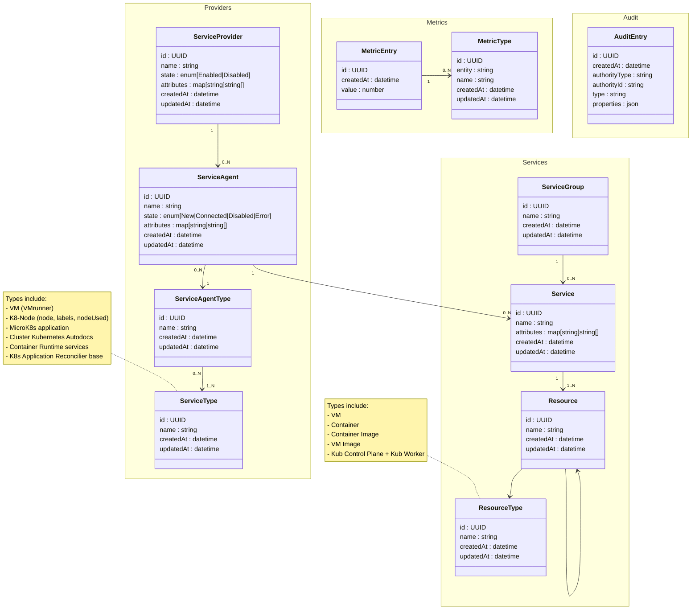

# Service Architecture Class Diagram

This document outlines the service architecture class relationships and their key components.

## Class Diagram

## Component Descriptions

### Core Components

1. **ServiceProvider (Cloud Service Provider)**
   - Primary identifier for the cloud service provider
   - One-to-many relationship with Service Managers

2. **ServiceAgent**
   - Manages service instances and their lifecycle
   - Contains type information
   - Links to both services and versioning

3. **Service**
   - Represents individual service instances
   - Maintains versioning through ServiceVersion
   - Associates with multiple resources

### Resource Management

1. **Resource**
   - Represents infrastructure resources
   - Supports versioning through ResourceVersion
   - Categorized by ResourceType

2. **ResourceType**
   - Categorizes resources into specific types:
     - Virtual Machines (VM)
     - Containers
     - Container Images
     - VM Images
     - Kubernetes Components

### Metrics