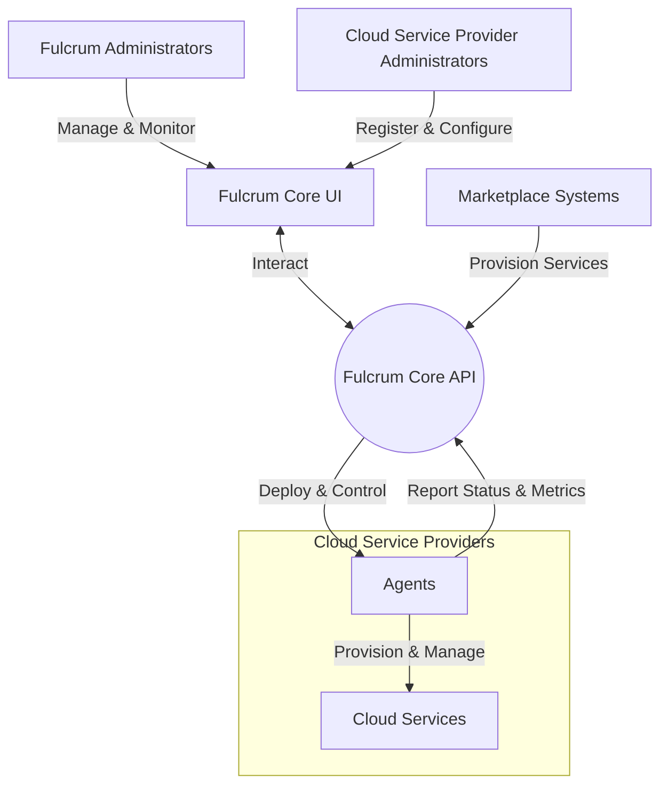
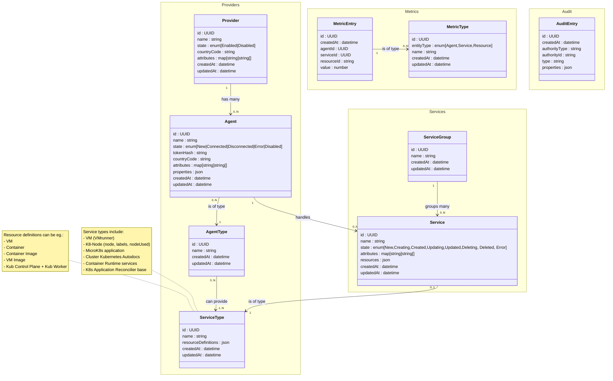
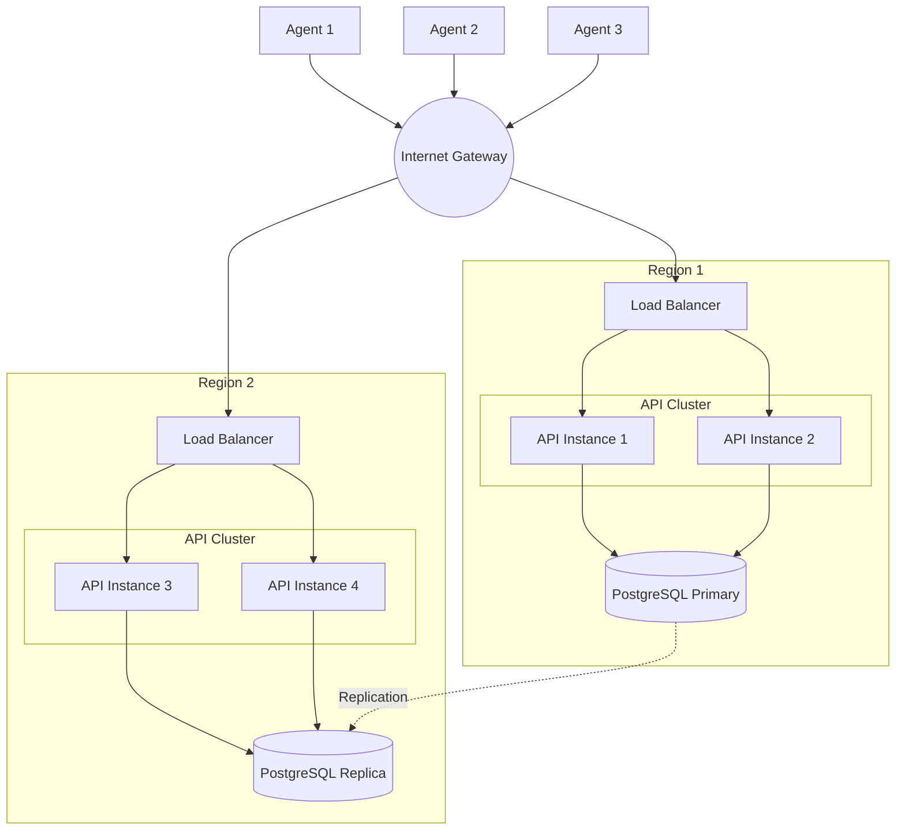

# Fulcrum Core

## Introduction

Fulcrum Core is a comprehensive cloud infrastructure management system designed to orchestrate and monitor distributed cloud resources across multiple providers. It serves as a centralized control plane for managing cloud service providers, their deployed agents, and the various services these agents provision and maintain.

The system is built as a RESTful API and enables organizations to:

- Manage multiple cloud service providers through a unified interface
- Track and control agents deployed across different cloud environments
- Provision and monitor various service types (VMs, containers, Kubernetes clusters, etc.)
- Organize services into logical groups for easier management
- Collect and analyze metrics from agents and services
- Maintain a comprehensive audit trail of all system operations

## Context

Fulcrum Core serves as a central management plane for cloud infrastructure, interacting with various actors in the ecosystem. The following diagram illustrates the key actors and their relationships with the Fulcrum Core API:

### Actors and Their Roles

#### Fulcrum Core UI

Fulcrum Core UI is the web interface that facilitates interaction between administrators and the Fulcrum Core API. It:

- Provides a graphical interface for system management and monitoring
- Translates user actions into API calls to the Fulcrum Core
- Displays system status, metrics, and analytics in an intuitive dashboard
- Offers role-based access control for different types of administrators

#### Agents

Agents are software components installed on Cloud Service Providers that act as Fulcrum's local representatives. They:

- Execute service provisioning and management commands from Fulcrum Core
- Report status, health metrics, and operational data back to Fulcrum
- Manage the lifecycle of deployed services (creation, updates, deletion)
- Handle local resource allocation and optimization
- Implement provider-specific operations and API interactions
- Maintain secure communications with the Fulcrum Core through token-based authentication

#### Fulcrum Administrators

Fulcrum Administrators are responsible for the overall management of the Fulcrum ecosystem. They:

- Configure global system settings and policies
- Monitor the health and performance of the entire system
- Manage user access and permissions
- Review audit logs and system metrics
- Orchestrate service groups across multiple providers
- Define service types and their resource requirements
- Oversee agent deployments and their operational status

#### Cloud Service Provider Administrators

Cloud Service Provider Administrators manage specific provider instances within the Fulcrum system. They:

- Register and configure provider details in Fulcrum
- Deploy and initialize agents on their cloud infrastructure
- Manage provider-specific attributes and capabilities
- Monitor services running on their provider infrastructure
- Handle provider-specific authentication and access controls
- Coordinate with Fulcrum Administrators on cross-provider operations

#### Marketplace Systems

Marketplace Systems are external platforms that can integrate with Fulcrum to automate service provisioning. They:

- Initiate service creation requests through the Fulcrum API
- Track provisioning status of requested services
- Provide service catalogs that map to Fulcrum service types
- Handle billing and usage reporting for provisioned services
- Enable user self-service for cloud resource management
- Integrate with Fulcrum's audit and metrics subsystems for comprehensive reporting

## Model

This paragraph outlines the service entities and their relationships.

### Class Diagram

#### Enities

##### Core

1. **Provider (Cloud Service Provider)**
   - Primary identifier for the cloud service provider
   - Contains essential provider information including name and operational state
   - Includes country code for geographical identification
   - Supports custom attributes for flexible metadata storage
   - One-to-many relationship with the Agents

2. **Agent**
   - Manages service instances and their lifecycle
   - Associated with a specific Provider and AgentType
   - Maintains state (New, Connected, Disconnected, Error, Disabled)
   - Secured with token-based authentication
   - Includes country code and custom attributes
   - Stores additional configuration in properties field

3. **Service**
   - Represents individual service instances
   - Managed by a specific Agent
   - Associated with a ServiceType and ServiceGroup
   - Tracks service lifecycle state
   - Contains custom attributes for metadata
   - Stores service-specific resources configuration

4. **AgentType**
   - Defines the type classification for agents
   - Has a unique name identifier
   - Many-to-many relationship with ServiceTypes
   - Determines which types of services an agent can manage

5. **ServiceType**
   - Defines the type classification for services
   - Has a unique name identifier
   - Contains resource definitions for different service configurations
   - Examples include VM, Container, Kubernetes nodes, etc.

6. **ServiceGroup**
   - Organizes related services into logical groups
   - Provides a way to manage collections of services
   - One-to-many relationship with Services

##### Metrics

1. **MetricEntry**
   - Records individual metric measurements
   - Associated with specific Agent and Service
   - Identifies the measured resource through ResourceID
   - Stores numerical measurement value
   - Links to MetricType for classification

2. **MetricType**
   - Defines categories of metrics that can be collected
   - Specifies the entity type being measured (Agent, Service, or Resource)
   - Provides naming and classification for metrics

##### Audit

1. **AuditEntry**
   - Tracks system events and changes
   - Records the authority (type and ID) that initiated the action
   - Categorizes events by type
   - Stores detailed event information in properties
   - Provides audit trail for system operations and changes

## Architecture

Fulcrum Core is built with Go, leveraging its concurrency model and performance characteristics to handle distributed infrastructure management efficiently. The system follows clean architecture principles, with clear separation of domain logic, data access, and API layers. The core technology stack includes:

- **Backend**: Go with Chi router for RESTful API endpoints
- **Database**: PostgreSQL with GORM for object-relational mapping
- **Containerization**: Docker and Docker Compose for deployment

### Architectural Layers

Fulcrum Core follows a clean, layered architecture to ensure separation of concerns, testability, and maintainability. The codebase is organized into the following layers:

1. **API Layer** (`internal/api/`)
   - Handles HTTP requests and responses using Chi router
   - Implements RESTful endpoints for all system entities
   - Manages request validation, error handling, and response formatting
   - Translates between HTTP/JSON and domain entities

2. **Domain Layer** (`internal/domain/`)
   - Contains core business entities and logic
   - Defines repository interfaces for data access abstraction
   - Implements value objects and entity state definitions
   - Remains technology-agnostic with no external dependencies

3. **Database Layer** (`internal/database/`)
   - Implements repository interfaces defined in the domain layer
   - Uses GORM to translate between domain entities and database models
   - Handles database-specific concerns like transactions and migrations
   - Includes testing utilities for database-backed unit tests

4. **Application Layer** (`cmd/fulcrum/`)
   - Serves as the application entry point
   - Configures dependencies and wires components together
   - Manages application lifecycle and environment configuration
   - Initializes and coordinates all system components

This layered approach allows for clear separation between business logic and infrastructure concerns, enabling easier testing, maintenance, and future extensions. The system follows the Dependency Inversion Principle, with higher layers defining interfaces that lower layers implement, ensuring that dependencies point inward toward the domain core.

### High-Availability Deployment

