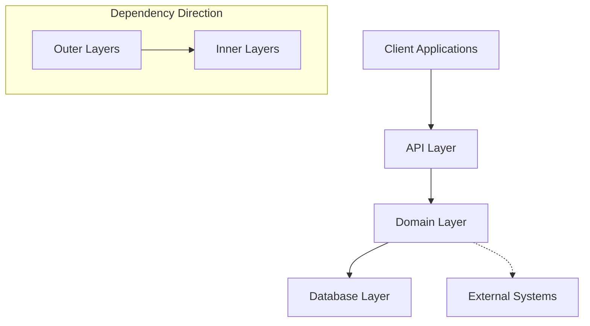

# Layer Architecture

## 1. Introduction

This document describe the layer architectural design of the system.

## 2. Clean Architecture Implementation

The system follows a clean architecture approach with clearly defined layers, each with specific responsibilities. This approach facilitates maintainability, testability, and the ability to adapt to changing requirements.



### 2.1 Design Principles

The architecture adheres to several key design principles:

- **Separation of Concerns**: Each layer has a specific responsibility
- **Dependency Inversion**: Dependencies point inward, with the domain layer at the core
- **Interface Segregation**: Smaller, focused interfaces for different concerns
- **Single Responsibility**: Each component has one reason to change
- **Clean Boundaries**: Each layer communicates through well-defined interfaces

## 3. System Layers

### 3.1 API Layer

The API layer is responsible for handling HTTP requests and providing a RESTful interface to clients. It:

- Defines routes and endpoints for all operations
- Converts between JSON/HTTP and domain objects using commons package types
- Implements authentication and authorization through middleware
- Manages pagination and filtering of results
- Implements error handling and response formatting
- The API layer uses a comprehensive middleware pattern that separates cross-cutting concerns from business logic

#### 3.1.1 Authentication and Authorization

The system implements a comprehensive authentication and authorization framework:

- **Token-based Authentication**: Uses secure tokens for API access with different roles (fulcrum_admin, participant, agent)
- **Role-based Authorization**: Different access levels based on user roles and resource ownership
- **Middleware Chain**: Authentication and authorization handled through middleware before reaching business logic
- **Resource Scoping**: Authorization decisions based on resource ownership and participant relationships
- **Commons Integration**: Uses shared authentication types and utilities from the commons package

#### 3.1.2 Handler Pattern

Each entity has its own handler following a consistent pattern with:

- Handler structure containing querier, commander, and authorization components
- Routes with middleware chains for cross-cutting concerns
- Simple authorization for list operations
- Body decoding and authorization for create operations
- Resource-specific routes with ID extraction
- Consistent patterns for GET, POST, and PATCH operations

#### 3.1.3 Pure Handler Methods

Handler methods focus solely on business logic, with authentication/authorization handled by middleware. They follow a pattern of:

- Getting pre-validated request data from context
- Executing business logic through commanders
- Handling domain errors appropriately
- Returning structured responses

### 3.2 Domain Layer

The domain layer contains the core business logic, entities, and interfaces. It:

- Defines all business entities and their behavior
- Contains pure business logic without external dependencies
- Defines repository interfaces for data access
- Implements domain services for complex operations
- Uses value objects for domain concepts

Domain entities use a rich domain model approach with behaviors encapsulated in the entities themselves, including state transitions and update operations.

The domain layer also defines `Commander` interfaces that encapsulate complex operations involving multiple entities. These commanders:

- Define interfaces for create, update, and transition operations
- Implement transaction handling through the store interface
- Coordinate multiple repository operations atomically
- Create related entities (like jobs and events) within the same transaction
- Ensure data consistency across entity boundaries

### 3.2.1 Transaction Management in Commands

The system implements a robust approach to transaction management through the Store interface:

1. **Store Interface**: Provides an `Atomic` method that executes a function within a transaction
2. **Transaction Boundaries**: Each command operation defines clear transaction boundaries
3. **All-or-Nothing Operations**: Multiple repository operations are executed atomically
4. **Consistent Event Log**: Events are created within the same transaction as the data changes

This pattern ensures:
- Data consistency across related entities
- Proper error handling with automatic rollback
- Events that perfectly match actual data changes
- Clean, reusable transaction logic that isn't tied to specific repositories

The `Atomic` method abstracts the transaction mechanism, allowing the domain layer to define transaction boundaries without coupling to database-specific transaction implementations.

### 3.3 Database Layer

The database layer implements the repository interfaces defined in the domain layer. It:

- Provides concrete implementations of repositories
- Implements the Command-Query separation pattern
- Handles database-specific concerns and transactions
- Performs ORM mapping between domain entities and database models
- Manages database queries and optimizations

The layer employs a Command-Query Responsibility Separation (CQRS) inspired approach:

- **Querier interfaces** define read-only operations (queries)
- **Repository interfaces** embed queriers and add command (write) operations
- This separation allows for more focused and optimized read operations

The database layer uses a repository pattern with a store interface managing transaction boundaries:

- **Store interface**: Provides atomic transaction handling and repository access
- **Repository interfaces**: Embed querier interfaces and add command operations
- **Querier interfaces**: Define read-only operations for query separation
- **Command operations**: Handle create, save, and delete operations
- **Transaction management**: Ensures atomic operations across multiple repositories

### 3.4 Application Layer

The application layer serves as the entry point and wires together all components:

- Initializes and configures the system
- Manages application lifecycle
- Sets up middleware and request processing pipelines
- Establishes connections to databases and external systems
- Launches background workers for maintenance tasks

## 4. Project Structure Layout

The system follows a modular directory structure that reinforces the separation of concerns and clean architecture principles:

```
/
├── cmd/             # Application entry points
│   └── server/      # Main application entry point
├── docs/            # Documentation
├── pkg/             # Application and library code
│   ├── api/         # HTTP handlers and routes
│   ├── authz/       # Authorization rules and policies
│   ├── config/      # Configuration handling
│   ├── database/    # Database implementations of repositories
│   └── domain/      # Domain models and repository interfaces
└── test/            # Test files
    └── rest/        # HTTP test files for API testing
```

### 4.1 Key Directories and Their Purposes

#### cmd/

The `cmd` directory contains the application entry points. Each subdirectory is a separate executable:

- `server/`: The main API server application
- Additional executables might include CLI tools, migration utilities, etc.

#### pkg/

The `pkg` directory contains all private application code, organized by architectural layer:

- `api/`: Contains all HTTP handlers, route definitions, middleware, and request/response models
  - Handler files are typically organized by domain entity
  - Middleware for authentication, authorization, and error handling
  - Response formatting utilities
  - Uses commons package for shared types and utilities

- `authz/`: Contains authorization rules and policies
  - Role-based access control implementation
  - Resource-specific authorization rules
  - Authorization middleware and extractors

- `domain/`: Contains the core business logic and entities
  - Entity definitions with behavior methods
  - Repository interfaces
  - Service/commander interfaces and implementations
  - Value objects and enums
  - Uses commons package for shared domain types

- `database/`: Contains repository implementations
  - ORM-specific repository implementations
  - Database connection management
  - Migration utilities
  - Query builders

- `config/`: Contains configuration handling
  - Environment variable processing
  - Configuration struct definitions
  - Defaults and validation

#### test/

The `test` directory contains test-related files that don't fit within the standard Go package structure:

- `rest/`: Contains HTTP files for API testing
- May include fixtures, test data, and other test support files

### 4.2 Package Dependencies

The package dependencies follow the dependency rule of clean architecture, with outer layers depending on inner layers:

```
api → domain ← database
  ↓     ↑        ↑
authz  config  commons
```

- `api` depends on `domain` to access entities and repository interfaces
- `api` depends on `authz` for authorization rules and policies
- `database` depends on `domain` to implement repository interfaces
- `authz` depends on `domain` for entity-specific authorization
- `config` is used by multiple packages but doesn't depend on other packages
- `domain` doesn't depend on any other internal package
- All layers use the `commons` package for shared types and utilities

## 5. Testing Strategies

The system employs multiple testing approaches:

### 5.1 Unit Testing

- Domain entity tests verify business rules and status transitions
- Mock interfaces enable isolated component testing
- Table-driven tests cover edge cases and validation

### 5.2 Repository Testing

- Database tests using test helpers and utilities
- Transaction-based test cleanup
- Seeding test data for consistent starting points

### 5.3 API Testing

- Handler tests with mocked domain services
- End-to-end API tests using HTTP test files
- Authentication and authorization testing

### 5.4 Integration Testing

- Tests that validate the interaction between layers
- Full-stack tests that exercise the entire system
- Database migrations and schema validation tests

## 6. Conclusion

This layered architecture represents a clean, maintainable design that adheres to solid software engineering principles. The separation of concerns between API, domain, and database layers creates clear boundaries and responsibilities while enabling complex business operations to be executed reliably.

The architecture demonstrates how proper separation of concerns and well-defined interfaces enable each layer to evolve independently while maintaining a cohesive overall system. The command pattern approach provides a clean way to encapsulate business logic and ensure data consistency.

This architecture is designed to be maintainable and extensible while maintaining a consistent programming model that is easy to understand.