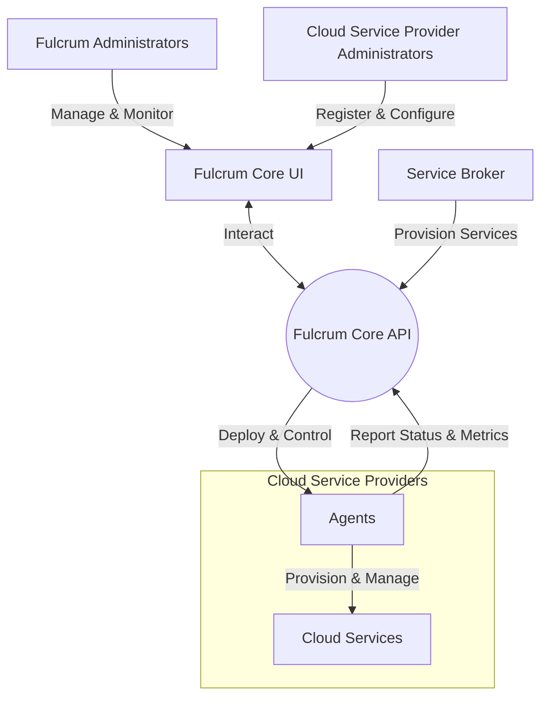
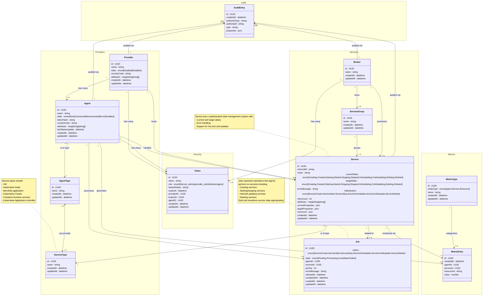
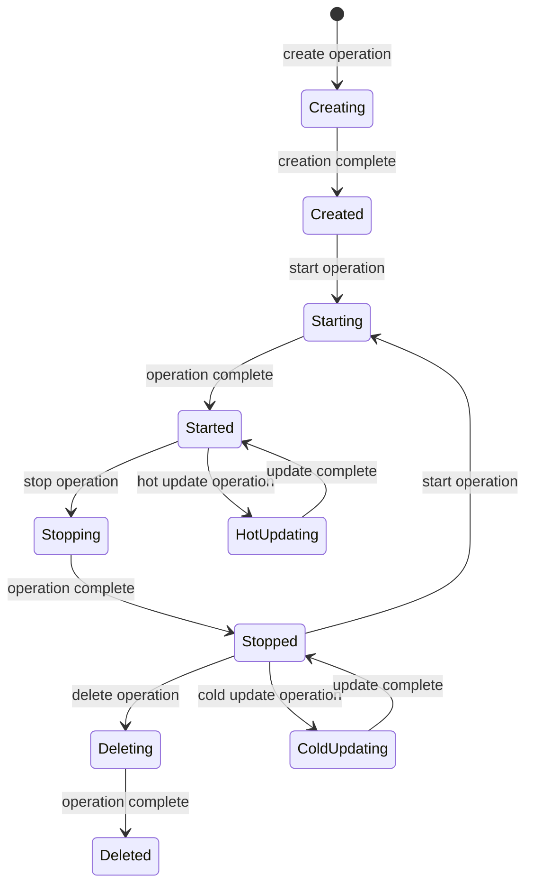
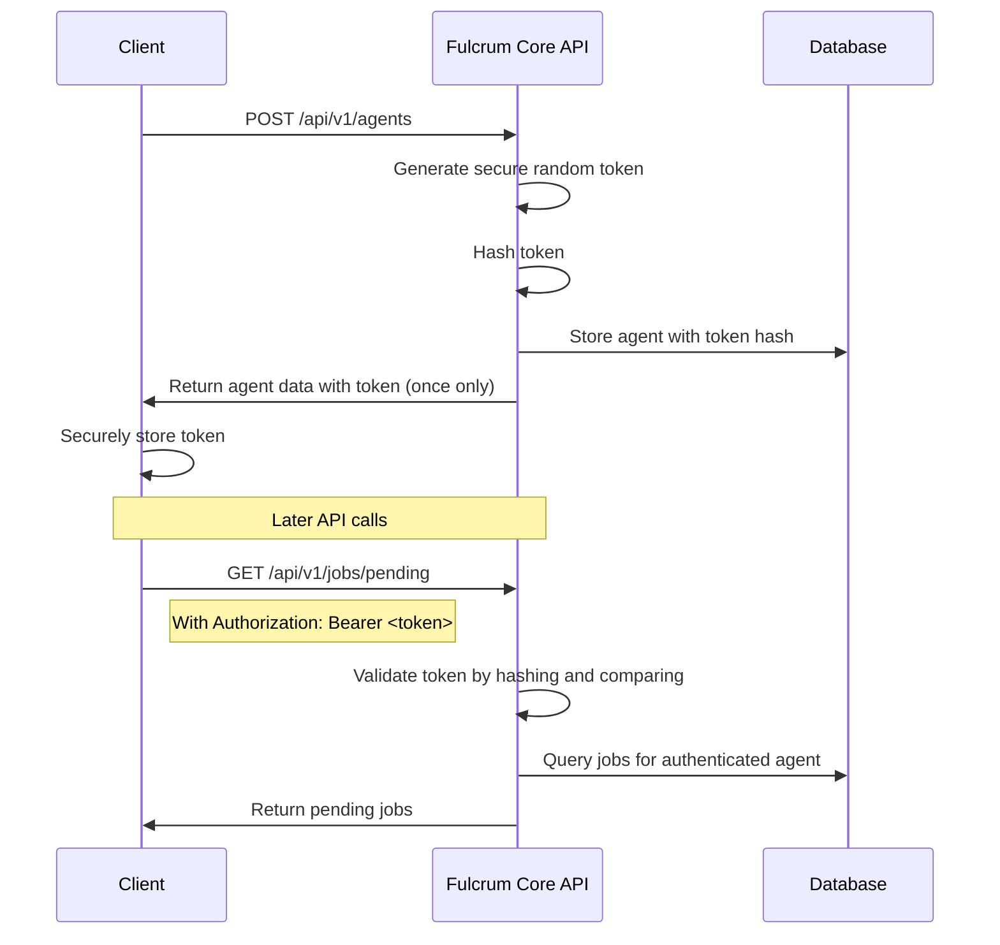
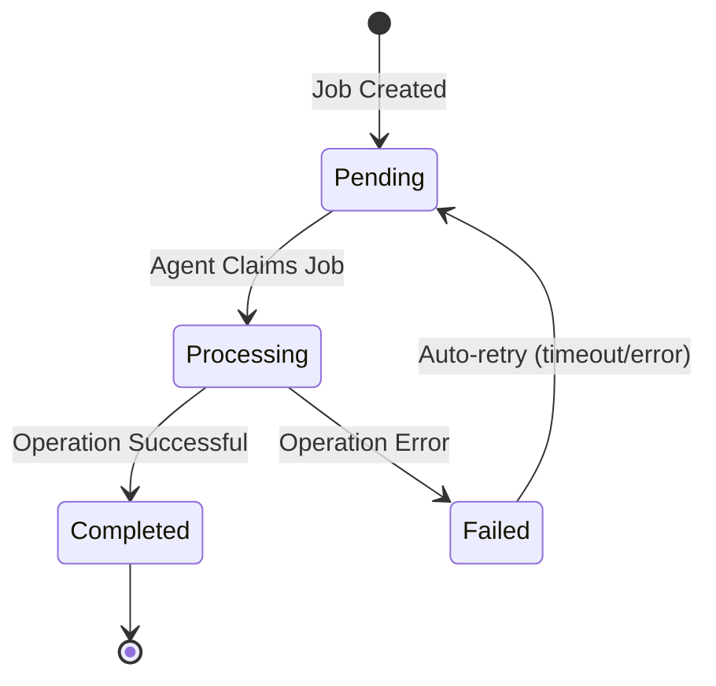
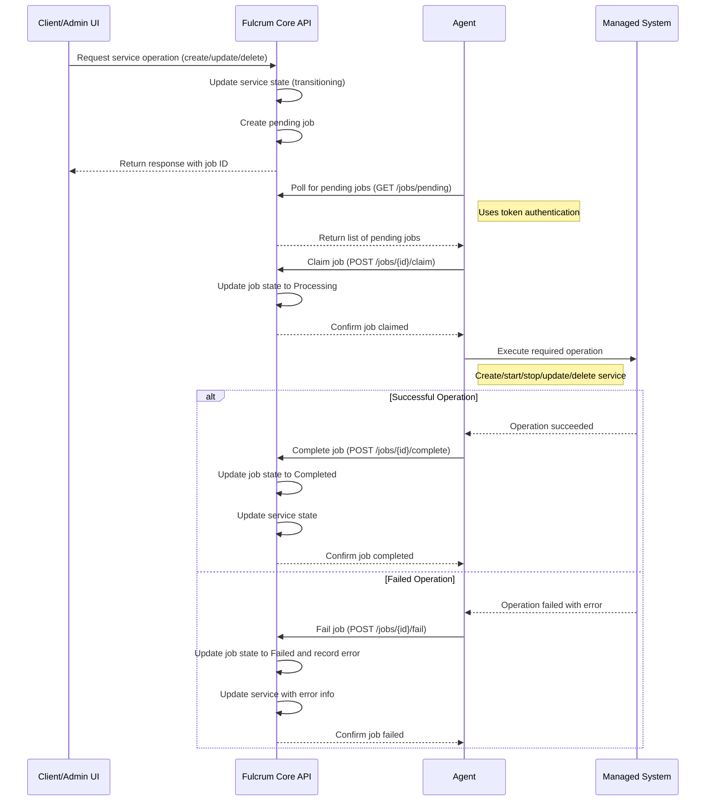

# Fulcrum Core Design

## Introduction

Fulcrum Core is a comprehensive cloud infrastructure management system designed to orchestrate and monitor distributed cloud resources across multiple providers. It serves as a centralized control plane for managing cloud service providers, their deployed agents, and the various services these agents provision and maintain.

The system is built as a RESTful API and enables organizations to:

- Manage multiple cloud service providers through a unified interface
- Track and control agents deployed across different cloud environments
- Provision and monitor various service types (VMs, containers, Kubernetes clusters, etc.)
- Organize services into logical groups for easier management
- Collect and analyze metrics from agents and services
- Maintain a comprehensive audit trail of all system operations
- Coordinate service operations with agents through a robust job queue system

## Documentation Structure

This document provides a high-level overview of the Fulcrum Core system design. For more detailed information, please refer to:

- [ARCHITECTURE.md](ARCHITECTURE.md): Detailed description of the system's layered architecture, package structure, and implementation patterns
- [AUTH.md](AUTH.md): Comprehensive authorization rules and role-based permissions
- [openapi.yaml](openapi.yaml): Complete API specification in OpenAPI format

## Context

Fulcrum Core serves as a central management plane for cloud infrastructure, interacting with various actors in the ecosystem. The following diagram illustrates the key actors and their relationships with the Fulcrum Core API:


### Actors and Their Roles

#### Fulcrum Core UI

Fulcrum Core UI is the web interface that facilitates interaction between administrators and the Fulcrum Core API. It:

- Provides a graphical interface for system management and monitoring
- Translates user actions into API calls to the Fulcrum Core
- Displays system status, metrics, and analytics in an intuitive dashboard
- Offers role-based access control for different types of administrators

#### Agents

Agents are software components installed on Cloud Service Providers that act as Fulcrum's local representatives. They:

- Execute service provisioning and management commands from Fulcrum Core
- Report status, health metrics, and operational data back to Fulcrum
- Manage the lifecycle of deployed services (creation, updates, deletion)
- Handle local resource allocation and optimization
- Implement provider-specific operations and API interactions
- Maintain secure communications with the Fulcrum Core through token-based authentication
- Poll for jobs from the job queue and process them
- Update job status upon completion or failure

#### Fulcrum Administrators

Fulcrum Administrators are responsible for the overall management of the Fulcrum ecosystem. They:

- Configure global system settings and policies
- Monitor the health and performance of the entire system
- Manage user access and permissions
- Review audit logs and system metrics
- Orchestrate service groups across multiple providers
- Define service types and their resource requirements
- Oversee agent deployments and their operational status
- Monitor job queue health and processing

#### Cloud Service Provider Administrators

Cloud Service Provider Administrators manage specific provider instances within the Fulcrum system. They:

- Register and configure provider details in Fulcrum
- Deploy and initialize agents on their cloud infrastructure
- Manage provider-specific attributes and capabilities
- Monitor services running on their provider infrastructure
- Handle provider-specific authentication and access controls
- Coordinate with Fulcrum Administrators on cross-provider operations

#### Service Broker

Service Broker (eg. Marketplaces) are external platforms that can integrate with Fulcrum to automate service provisioning. They:

- Initiate service creation requests through the Fulcrum API
- Track provisioning status of requested services
- Provide service catalogs that map to Fulcrum service types
- Handle billing and usage reporting for provisioned services
- Enable user self-service for cloud resource management
- Integrate with Fulcrum's audit and metrics subsystems for comprehensive reporting

## Model

This section outlines the service entities and their relationships.

### Class Diagram



#### Entities

##### Core

1. **Provider (Cloud Service Provider)**
   - Represents a cloud service provider with name and operational state
   - Contains geographical information via country code
   - Stores flexible metadata through custom attributes
   - Has many agents deployed within its infrastructure

2. **Agent**
   - Deployed software component that manages services
   - Belongs to a specific Provider and AgentType
   - Tracks connectivity state (New, Connected, Disconnected, Error, Disabled)
   - Uses secure token-based authentication
   - Tracks last status update timestamp
   - Processes jobs from the job queue to perform service operations

3. **Service**
   - Cloud resource managed by an agent
   - Sophisticated state management with current and target states
   - State transitions: Creating → Created → Starting → Started → Stopping → Stopped → Deleting → Deleted
   - Supports both hot updates (while running) and cold updates (while stopped)
   - Tracks failed operations with error messages and retry counts
   - Contains attributes for metadata about the service
    - Manages configuration changes through current and target properties
   - Stores service-specific resource configuration

   Properties vs Attributes:
   - Properties: JSON data representing the service configuration that can be updated during the service lifecycle. Updates to properties trigger state transitions (hot or cold update depending on current state).
   - Attributes: Metadata about the service that is set during creation and remains static throughout the service lifecycle. Used for provider and agent selection during service creation and more generally for identification, categorization, and filtering.

4. **AgentType**
   - Defines the type classification for agents
   - Many-to-many relationship with ServiceTypes
   - Determines which types of services an agent can manage

5. **ServiceType**
   - Defines the type classification for services
   - Examples include VM, Container, Kubernetes nodes, etc.

6. **ServiceGroup**
   - Organizes related services into logical groups
   - Enables collective management of related services

7. **Job**
   - Represents a discrete operation to be performed by an agent
   - Action types match service transitions: Create, Start, Stop, HotUpdate, ColdUpdate, Delete
   - Lifecycle states: Pending → Processing → Completed/Failed
   - Prioritizes operations for execution order
   - Tracks execution timing through claimedAt and completedAt
   - Records error details for failed operations

8. **Broker (Service Broker)**
  - Represents an external platform that integrates with Fulcrum to provision services
  - Has a name and unique identifier for API integration
  - May have multiple tokens with broker role for authentication

9. **Token**
  - Provides secure authentication mechanism for system access
  - Supports different roles: FulcrumAdmin, ProviderAdmin, Broker, Agent
  - Contains hashed value stored in database to verify authentication
  - Has expiration date for enhanced security
  - Scoped to specific Provider, Broker, or Agent based on role
  - Note: The current token implementation is a facility to handle authentication locally and will be replaced with an external authentication standard mechanism in the future, such as OAuth 2.0, OpenID Connect, or SAML

##### Metrics

1. **MetricEntry**
   - Records individual metric measurements
   - Associated with specific Agent and Service
   - Identifies the measured resource through ResourceID
   - Stores numerical measurement value
   - Links to MetricType for classification

2. **MetricType**
   - Defines categories of metrics that can be collected
   - Specifies the entity type being measured (Agent, Service, or Resource)
   - Provides naming and classification for metrics

##### Audit

1. **AuditEntry**
   - Tracks system events and changes
   - Records the authority (type and ID) that initiated the action
   - Categorizes events by type
   - Stores detailed event information in properties
   - Provides audit trail for system operations and changes

##### Security

Fulcrum Core implements a comprehensive authorization system with role-based access control (RBAC):

- Four predefined roles: FulcrumAdmin, ProviderAdmin, Broker, and Agent
- Fine-grained permission control for different resource types and actions
- Context-aware permissions based on resource ownership and relationships

The authentication system currently uses tokens, which will be replaced with an industry-standard external authentication mechanism in the future, such as OAuth 2.0, OpenID Connect, or SAML.

For detailed information about roles, permissions, and authorization rules, refer to [AUTH.md](AUTH.md).


## Technical Overview

Fulcrum Core is built with Go, leveraging its concurrency model and performance characteristics to handle distributed infrastructure management efficiently. The system follows clean architecture principles, with clear separation of domain logic, data access, and API layers. The core technology stack includes:

- **Backend**: Go with Chi router for RESTful API endpoints
- **Database**: PostgreSQL with GORM for object-relational mapping
- **Containerization**: Docker and Docker Compose for deployment

For detailed information about the system's architecture, layers, and implementation patterns, refer to [ARCHITECTURE.md](ARCHITECTURE.md).

### Services, Agents, and Jobs

#### Service State Transitions

The following diagram illustrates the various states a service can transition through during its lifecycle:



#### Agent Authentication Flow



#### Job Management Flow

Job states and transitions can be visualized as follows:



The job queue system manages the complete lifecycle of service operations from creation to completion. The following diagram illustrates the job management flow:



The job management process follows these steps:

1. **Job Creation**: 
   - When a service operation (create, update, delete) is initiated via the API
   - The ServiceCommander creates a job with state "Pending"
   - The job is assigned to the appropriate agent
   - Job contains all necessary data to perform the operation

2. **Job Polling and Claiming**:
   - Agents periodically poll `/api/v1/jobs/pending` for new jobs
   - When a job is available, the agent claims it using `/api/v1/jobs/{id}/claim`
   - The job state changes to "Processing"
   - A timestamp is recorded in the `claimedAt` field

3. **Job Processing**:
   - The agent performs the requested operation on the cloud provider
   - The agent maintains a secure connection with the job queue using token-based authentication
   - During processing, the service state reflects the operation (Creating, Starting, Stopping, HotUpdating, ColdUpdating, Deleting)

4. **Job Completion**:
   - On successful completion, the agent calls `/api/v1/jobs/{id}/complete` with result data
   - The job state changes to "Completed"
   - A timestamp is recorded in the `completedAt` field
   - The service state is updated accordingly (Created, Started, Stopped, Deleted)
   - For property updates, the `currentProperties` are set to match the `targetProperties` upon successful completion

5. **Job Failure Handling**:
   - If an operation fails, the agent calls `/api/v1/jobs/{id}/fail` with error details
   - The job state changes to "Failed"
   - The service state is updated to reflect the error
   - Jobs may be automatically retried based on error type and configured policies

6. **Job Maintenance**:
   - Background workers periodically:
     - Release stuck jobs (processing too long)
     - Clean up old completed jobs after retention period
     - Handle retry logic for failed jobs
     - Monitor queue health and performance metrics

### High-Availability Deployment

```mermaid
graph TB
    %% Internet entry point
    Internet((Internet Gateway))
    
    %% Region 1
    subgraph Region1[Region 1]
        LB1[Load Balancer]
        
        subgraph APICluster1[API Cluster]
            API1[API Instance 1]
            API2[API Instance 2]
        end
        
        DB1[(PostgreSQL Primary)]
    end
    
    %% Region 2
    subgraph Region2[Region 2]
        LB2[Load Balancer]
        
        subgraph APICluster2[API Cluster]
            API3[API Instance 3]
            API4[API Instance 4]
        end
        
        DB2[(PostgreSQL Replica)]
    end
    
    %% Agents
    Agent1[Agent 1]
    Agent2[Agent 2]
    Agent3[Agent 3]
    
    %% Connections
    Internet --> LB1 & LB2
    LB1 --> API1 & API2
    LB2 --> API3 & API4
    API1 & API2 --> DB1
    API3 & API4 --> DB2
    DB1 -.Replication.-> DB2
    Agent1 & Agent2 & Agent3 --> Internet
