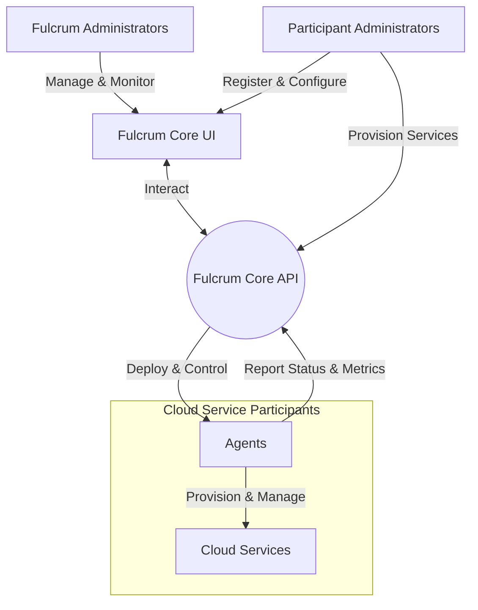
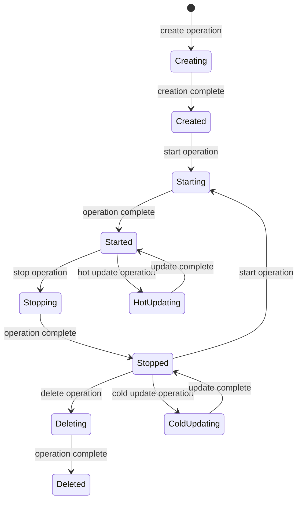
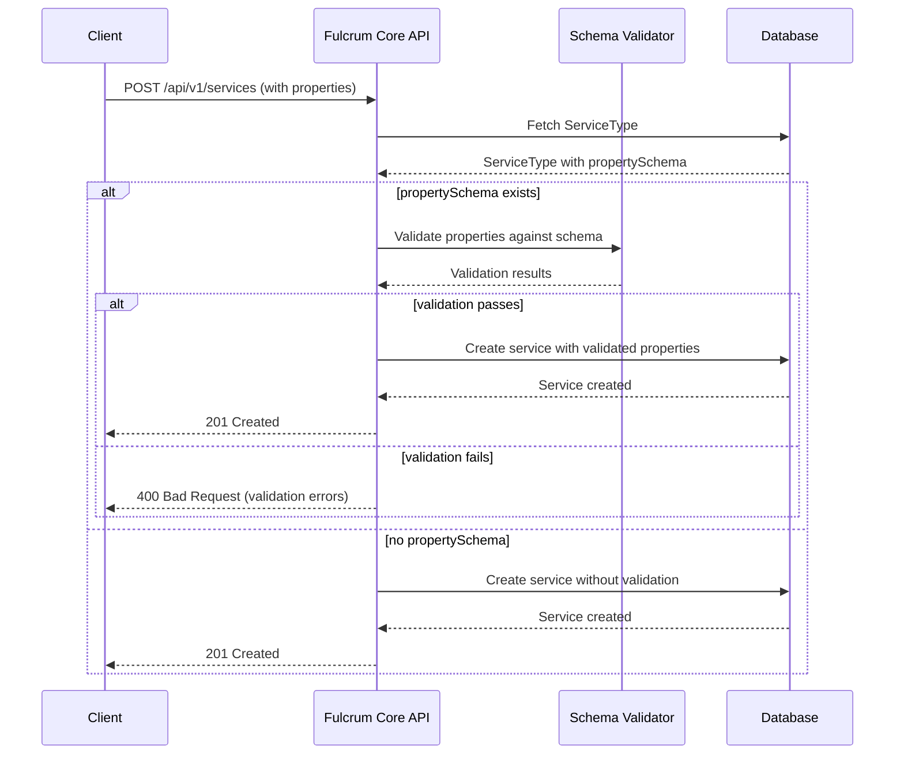
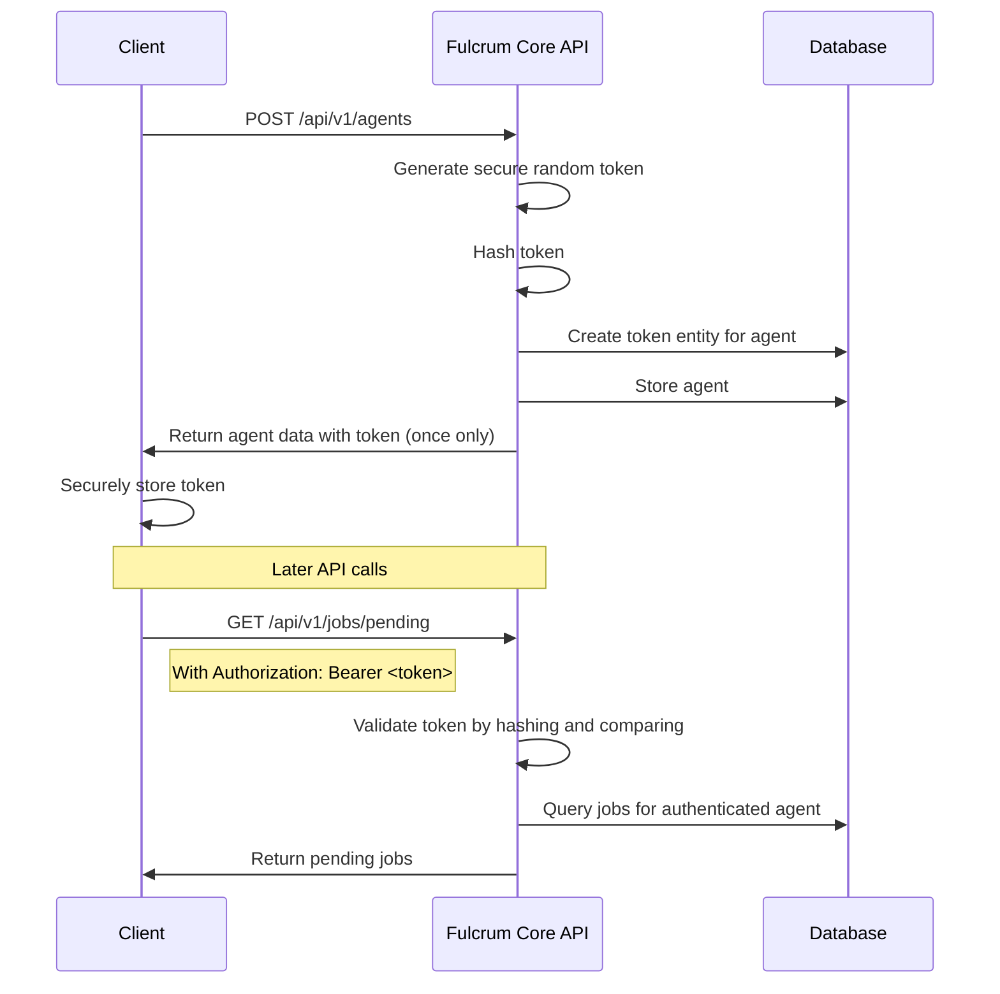
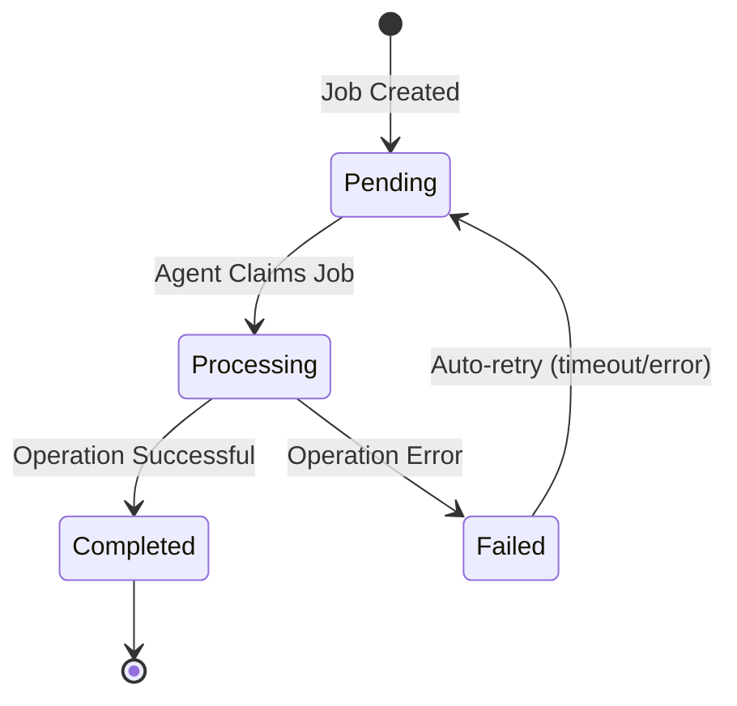
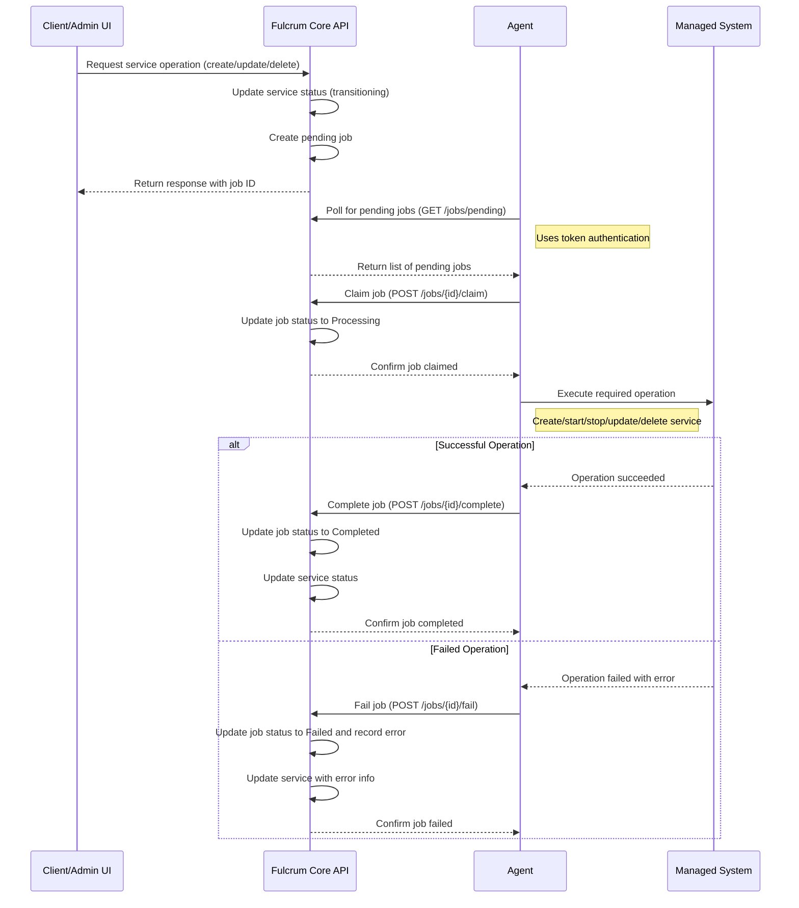

# Fulcrum Core Design

## Introduction

Fulcrum Core is a comprehensive cloud infrastructure management system designed to orchestrate and monitor distributed cloud resources across multiple providers. It serves as a centralized control plane for managing cloud service participants, their deployed agents, and the various services these agents provision and maintain.

The system is built as a RESTful API and enables organizations to:

- Manage multiple cloud service participants through a unified interface
- Track and control agents deployed across different cloud environments
- Provision and monitor various service types (VMs, containers, Kubernetes clusters, etc.)
- Organize services into logical groups for easier management
- Collect and analyze metrics from agents and services
- Maintain a comprehensive audit trail of all system operations
- Coordinate service operations with agents through a robust job queue system

## Documentation Structure

This document provides a high-level overview of the Fulcrum Core system design. For more detailed information, please refer to:

- [ARCHITECTURE.md](ARCHITECTURE.md): Detailed description of the system's layered architecture, package structure, and implementation patterns
- [AUTHORIZATION.md](AUTHORIZATION.md): Comprehensive authorization rules and role-based permissions
- [SERVICE_TYPE_SCHEMA.md](SERVICE_TYPE_SCHEMA.md): Service property schema validation syntax and usage guide
- [openapi.yaml](openapi.yaml): Complete API specification in OpenAPI format

## Context

Fulcrum Core serves as a central management plane for cloud infrastructure, interacting with various actors in the ecosystem. The following diagram illustrates the key actors and their relationships with the Fulcrum Core API:


### Actors and Their Roles

#### Fulcrum Core UI

Fulcrum Core UI is the web interface that facilitates interaction between administrators and the Fulcrum Core API. It:

- Provides a graphical interface for system management and monitoring
- Translates user actions into API calls to the Fulcrum Core
- Displays system status, metrics, and analytics in an intuitive dashboard
- Offers role-based access control for different types of administrators

#### Agents

Agents are software components installed on Cloud Service Participants that act as Fulcrum's local representatives. They:

- Execute service provisioning and management commands from Fulcrum Core
- Report status, health metrics, and operational data back to Fulcrum
- Manage the lifecycle of deployed services (creation, updates, deletion)
- Handle local resource allocation and optimization
- Implement participant-specific operations and API interactions
- Maintain secure communications with the Fulcrum Core through token-based authentication
- Poll for jobs from the job queue and process them
- Update job status upon completion or failure

#### Fulcrum Administrators

Fulcrum Administrators are responsible for the overall management of the Fulcrum ecosystem. They:

- Configure global system settings and policies
- Monitor the health and performance of the entire system
- Manage user access and permissions
- Review audit logs and system metrics
- Orchestrate service groups across multiple participants
- Define service types and their resource requirements
- Oversee agent deployments and their operational status
- Monitor job queue health and processing

#### Participant Administrators

Participant Administrators manage specific participant instances within the Fulcrum system. They:

- Register and configure participant details in Fulcrum
- Deploy and initialize agents on their cloud infrastructure
- Manage participant-specific attributes and capabilities
- Monitor services running on their infrastructure
- Handle participant-specific authentication and access controls
- Coordinate with Fulcrum Administrators on cross-participant operations
- May act as both service providers and consumers depending on context

## Model

This section outlines the service entities and their relationships.

### Class Diagram

```mermaid
classDiagram
    Participant "1" --> "0..N" Agent : has many
    AgentType "0..N" <--> "1..N" ServiceType : can provide
    Agent "0..N" --> "1" AgentType : is of type
    Agent "1" --> "0..N" Service : handles
    Agent "1" --> "0..N" Job : processes
    Service "0..1" --> "1" ServiceType : is of type
    Service "1" --> "0..N" Job : related to
    ServiceGroup "1" --> "0..N" Service : groups
    MetricType "1" --> "0..N" MetricEntry : categorizes
    Participant "1" --> "0..N" Token : has many
    Agent "1" --> "0..N" Token : has many
    Agent "1" --> "0..N" MetricEntry : generates
    Service "1" --> "0..N" MetricEntry : monitored via
    Participant "1" --> "0..N" Service : consumes (via ConsumerParticipantID)
    Participant "1" --> "0..N" ServiceGroup : owns
    Participant "1" --> "0..N" Service : hosts (via Agent)
    AuditEntry "0..N" <-- "1" Agent : audited via
    AuditEntry "0..N" <-- "1" Service : audited via
    AuditEntry "0..N" <-- "1" Participant : audited via

    namespace Participants {
        class Participant {
            id : UUID
            name : string
            status : enum[Enabled|Disabled]
            createdAt : datetime
            updatedAt : datetime
        }

        class ServiceType {
            id : UUID
            name : string
            propertySchema : CustomSchema
            createdAt : datetime
            updatedAt : datetime
        }

        class AgentType {
            id : UUID
            name : string
            createdAt : datetime
            updatedAt : datetime
        }

        class Agent {
            id : UUID
            name : string
            status : enum[New|Connected|Disconnected|Error|Disabled]
            lastStatusUpdate : datetime
            tags : string[]
            createdAt : datetime
            updatedAt : datetime
        }
    }

    namespace Services {
        class Service {
            id : UUID
            externalId : string
            name : string
            currentStatus : enum[Creating,Created,Starting,Started,Stopping,Stopped,HotUpdating,ColdUpdating,Deleting,Deleted]
            targetStatus : enum[Creating,Created,Starting,Started,Stopping,Stopped,HotUpdating,ColdUpdating,Deleting,Deleted]
            errorMessage : string
            failedAction : enum[ServiceCreate,ServiceStart,ServiceStop,ServiceHotUpdate,ServiceColdUpdate,ServiceDelete]
            retryCount : int
            currentProperties : json
            targetProperties : json
            resources : json
            consumerParticipantID : UUID
            createdAt : datetime
            updatedAt : datetime
        }

        class ServiceGroup {
            id : UUID
            name : string
            participantID : UUID
            createdAt : datetime
            updatedAt : datetime
        }

        class Job {
            id : UUID
            action : enum[ServiceCreate,ServiceStart,ServiceStop,ServiceHotUpdate,ServiceColdUpdate,ServiceDelete]
            status : enum[Pending,Processing,Completed,Failed]
            agentId : UUID
            serviceId : UUID
            priority : int
            errorMessage : string
            claimedAt : datetime
            completedAt : datetime
            createdAt : datetime
            updatedAt : datetime
        }
    }

    namespace Security {
        class Token {
            id : UUID
            name : string
            role : enum[fulcrum_admin|participant|agent]
            hashedValue : string
            expireAt : datetime
            participantID : UUID
            agentID : UUID
            createdAt : datetime
            updatedAt : datetime
        }
    }

    namespace Metrics {
        class MetricEntry {
            id : UUID
            createdAt : datetime
            agentId : UUID        
            serviceId : UUID        
            resourceId : string
            value : number
        }

        class MetricType {
            id : UUID
            entityType : enum[Agent,Service,Resource] 
            name : string
            createdAt : datetime
            updatedAt : datetime
        }
    }

    namespace Audit {
        class AuditEntry {
            id : UUID
            createdAt : datetime
            authorityType : string
            authorityId : string
            type : string
            properties : json
        }
    }

    note for Service "Service has a sophisticated status management system with:
    - Current and target statuss
    - Error handling
    - Support for hot and cold updates"

    note for ServiceType "Service types include:
    - VM
    - Kubernetes Node
    - MicroK8s application
    - Kubernetes Cluster
    - Container Runtime services
    - Kubernetes Application controller
    
    Agents can provide specific service types
    based on their AgentType capabilities and
    tags for specialized requirements"
    
    note for Job "Jobs represent operations that agents
    perform on services including:
    - Creating services
    - Starting/stopping services
    - Hot/cold updating services
    - Deleting services
    
    Each job transitions service status appropriately"
    
```



#### Entities

##### Core

1. **Participant**
   - Unified entity replacing the separate Provider and Consumer entities
   - Represents an entity that can act as both a service provider and consumer
   - Has name and operational status (Enabled/Disabled)
   - Has many agents deployed within its infrastructure (when acting as a provider)
   - Can consume services (via Service.ConsumerParticipantID)
   - The functional role (provider/consumer) is determined by context and relationships

2. **Agent**
   - Deployed software component that manages services
   - Belongs to a specific Participant (acting as provider) and AgentType
   - Tracks connectivity status (New, Connected, Disconnected, Error, Disabled)
   - Uses secure token-based authentication (via Token entity)
   - Tracks last status update timestamp
   - Contains tags for capabilities and specializations
   - Processes jobs from the job queue to perform service operations
   - Selected for service provisioning based on service type and tag matching

3. **Service**
   - Cloud resource managed by an agent
   - Sophisticated status management with current and target statuss
   - Status transitions: Creating → Created → Starting → Started → Stopping → Stopped → Deleting → Deleted
   - Supports both hot updates (while running) and cold updates (while stopped)
   - Tracks failed operations with error messages and retry counts
   - Manages configuration changes through current and target properties
   - Stores service-specific resource configuration
   - Can be linked to a consumer participant via ConsumerParticipantID (optional)

   Properties:
   - Properties: JSON data representing the service configuration that can be updated during the service lifecycle. Updates to properties trigger status transitions (hot or cold update depending on current status).

4. **AgentType**
   - Defines the type classification for agents
   - Many-to-many relationship with ServiceTypes
   - Determines which types of services an agent can manage

5. **ServiceType**
   - Defines the type classification for services
   - Examples include VM, Container, Kubernetes nodes, etc.

6. **ServiceGroup**
   - Organizes related services into logical groups
   - Belongs to a specific Participant
   - Enables collective management of related services

7. **Job**
   - Represents a discrete operation to be performed by an agent
   - Action types match service transitions: Create, Start, Stop, HotUpdate, ColdUpdate, Delete
   - Lifecycle statuss: Pending → Processing → Completed/Failed
   - Prioritizes operations for execution order
   - Tracks execution timing through claimedAt and completedAt
   - Records error details for failed operations

8. **Token**
   - Provides secure authentication mechanism for system access
   - Supports different roles: fulcrum_admin, participant, agent
   - Contains hashed value stored in database to verify authentication
   - Has expiration date for enhanced security
   - Scoped to specific Participant or Agent based on role
   - Note: The current token implementation is a facility to handle authentication locally and will be replaced with an external authentication standard mechanism in the future, such as OAuth 2.0, OpenID Connect, or SAML

##### Metrics

1. **MetricEntry**
   - Records individual metric measurements
   - Associated with specific Agent and Service
   - Identifies the measured resource through ResourceID
   - Stores numerical measurement value
   - Links to MetricType for classification

2. **MetricType**
   - Defines categories of metrics that can be collected
   - Specifies the entity type being measured (Agent, Service, or Resource)
   - Provides naming and classification for metrics

##### Audit

1. **AuditEntry**
   - Tracks system events and changes
   - Records the authority (type and ID) that initiated the action
   - Categorizes events by type
   - Stores detailed event information in properties
   - Provides audit trail for system operations and changes

##### Security

Fulcrum Core implements a comprehensive authorization system with role-based access control (RBAC):

- Three predefined roles: fulcrum_admin, participant, and agent
- Fine-grained permission control for different resource types and actions
- Context-aware permissions based on resource ownership and relationships

The authentication system currently uses tokens, which will be replaced with an industry-standard external authentication mechanism in the future, such as OAuth 2.0, OpenID Connect, or SAML.

For detailed information about roles, permissions, and authorization rules, refer to [AUTHORIZATION.md](AUTHORIZATION.md).


## Technical Overview

Fulcrum Core is built with Go, leveraging its concurrency model and performance characteristics to handle distributed infrastructure management efficiently. The system follows clean architecture principles, with clear separation of domain logic, data access, and API layers. The core technology stack includes:

- **Backend**: Go with Chi router for RESTful API endpoints
- **Database**: PostgreSQL with GORM for object-relational mapping
- **Containerization**: Docker and Docker Compose for deployment

For detailed information about the system's architecture, layers, and implementation patterns, refer to [ARCHITECTURE.md](ARCHITECTURE.md).

### Services, Agents, and Jobs

#### Service Status Transitions

The following diagram illustrates the various statuss a service can transition through during its lifecycle:



#### Service Property Schema Validation

Fulcrum Core provides a flexible JSON-based validation system for service properties through the Service Property Schema feature. This system ensures data integrity and consistency for service configurations while providing dynamic validation without requiring application recompilation.

##### Schema Structure

Each ServiceType can have an optional `propertySchema` field that defines validation rules for service properties. The schema supports:

- **Primitive Types**: string, integer, number, boolean
- **Complex Types**: object (with nested properties), array (with item schemas)
- **Validation Rules**: minLength, maxLength, pattern, enum, min, max, minItems, maxItems, uniqueItems
- **Nested Validation**: Recursive validation for objects and arrays
- **Default Values**: Automatic application of default values for missing properties

##### Validation Flow



##### Validation API Endpoint

The system provides a dedicated validation endpoint for testing property schemas:

- **Endpoint**: `POST /api/v1/service-types/{id}/validate`
- **Purpose**: Validate service properties against a ServiceType's schema
- **Response**: Returns validation status and detailed error messages
- **Use Cases**: Frontend validation, schema testing, development workflows

For detailed schema syntax and examples, see [SERVICE_TYPE_SCHEMA.md](SERVICE_TYPE_SCHEMA.md).

#### Agent Authentication Flow



#### Job Management Flow

Job statuss and transitions can be visualized as follows:



The job queue system manages the complete lifecycle of service operations from creation to completion. The following diagram illustrates the job management flow:



The job management process follows these steps:

1. **Job Creation**: 
   - When a service operation (create, update, delete) is initiated via the API
   - The ServiceCommander creates a job with status "Pending"
   - The job is assigned to the appropriate agent
   - Job contains all necessary data to perform the operation

2. **Job Polling and Claiming**:
   - Agents periodically poll `/api/v1/jobs/pending` for new jobs
   - When a job is available, the agent claims it using `/api/v1/jobs/{id}/claim`
   - The job status changes to "Processing"
   - A timestamp is recorded in the `claimedAt` field

3. **Job Processing**:
   - The agent performs the requested operation on the cloud participant
   - The agent maintains a secure connection with the job queue using token-based authentication
   - During processing, the service status reflects the operation (Creating, Starting, Stopping, HotUpdating, ColdUpdating, Deleting)

4. **Job Completion**:
   - On successful completion, the agent calls `/api/v1/jobs/{id}/complete` with result data
   - The job status changes to "Completed"
   - A timestamp is recorded in the `completedAt` field
   - The service status is updated accordingly (Created, Started, Stopped, Deleted)
   - For property updates, the `currentProperties` are set to match the `targetProperties` upon successful completion

5. **Job Failure Handling**:
   - If an operation fails, the agent calls `/api/v1/jobs/{id}/fail` with error details
   - The job status changes to "Failed"
   - The service status is updated to reflect the error
   - Jobs may be automatically retried based on error type and configured policies

6. **Job Maintenance**:
   - Background workers periodically:
     - Release stuck jobs (processing too long)
     - Clean up old completed jobs after retention period
     - Handle retry logic for failed jobs
     - Monitor queue health and performance metrics

### High-Availability Deployment

```mermaid
graph TB
    %% Internet entry point
    Internet((Internet Gateway))
    
    %% Region 1
    subgraph Region1[Region 1]
        LB1[Load Balancer]
        
        subgraph APICluster1[API Cluster]
            API1[API Instance 1]
            API2[API Instance 2]
        end
        
        DB1[(PostgreSQL Primary)]
    end
    
    %% Region 2
    subgraph Region2[Region 2]
        LB2[Load Balancer]
        
        subgraph APICluster2[API Cluster]
            API3[API Instance 3]
            API4[API Instance 4]
        end
        
        DB2[(PostgreSQL Replica)]
    end
    
    %% Agents
    Agent1[Agent 1]
    Agent2[Agent 2]
    Agent3[Agent 3]
    
    %% Connections
    Internet --> LB1 & LB2
    LB1 --> API1 & API2
    LB2 --> API3 & API4
    API1 & API2 --> DB1
    API3 & API4 --> DB2
    DB1 -.Replication.-> DB2
    Agent1 & Agent2 & Agent3 --> Internet
