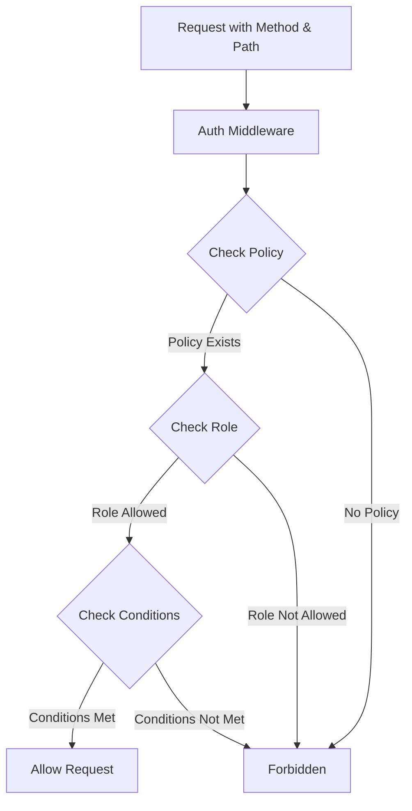

# Authorization Schema Based on Endpoints, Methods, and Roles

## Overview

This document outlines a declarative and flexible authorization schema for the Fulcrum Core API, based on endpoints, HTTP methods, and user roles. This schema allows for fine-grained access control with a clear, maintainable structure.

## Architecture



## Core Components

### 1. Endpoint Policy Structure

```go
// EndpointPolicy defines access policy for an endpoint
type EndpointPolicy struct {
    // Pattern is a regex pattern to match the endpoint path
    Pattern *regexp.Regexp
    
    // Methods maps HTTP methods to roles and conditions
    Methods map[string]map[domain.UserRole][]RoleCondition
}
```

Each endpoint policy consists of:
- A regex pattern that matches the endpoint path
- A map of HTTP methods, each containing:
  - Allowed user roles
  - Optional conditions for role-specific access checks

### 2. Role Conditions

Role conditions are functions that perform additional checks beyond simple role-based authorization:

```go
// RoleCondition represents a function that determines if a user with a specific role
// can access a resource based on additional checks
type RoleCondition func(user *domain.AuthUser, r *http.Request) bool
```

These conditions allow for dynamic authorization rules such as:
- Provider administrators can only access their own provider resources
- Marketplace users can only access services they own
- Fine-grained control based on resource ownership

### 3. Authorization Config

The central configuration holds all endpoint policies:

```go
// AuthConfig contains endpoint authorization policies
type AuthConfig struct {
    Policies []EndpointPolicy
}
```

## Authorization Schema by Endpoint

| Endpoint Pattern                               | Method    | Fulcrum Admin | Provider Admin | Marketplace | Conditions                                                          |
| ---------------------------------------------- | --------- | ------------- | -------------- | ----------- | ------------------------------------------------------------------- |
| `/api/v1/providers$`                           | GET       | ✅             | ✅              | ❌           | None for Provider Admin                                             |
| `/api/v1/providers$`                           | POST      | ✅             | ❌              | ❌           | None                                                                |
| `/api/v1/providers/[^/]+$`                     | GET       | ✅             | ✅              | ❌           | Provider Admin: Own provider only                                   |
| `/api/v1/providers/[^/]+$`                     | PUT/PATCH | ✅             | ✅              | ❌           | Provider Admin: Own provider only                                   |
| `/api/v1/providers/[^/]+$`                     | DELETE    | ✅             | ❌              | ❌           | None                                                                |
| `/api/v1/agent-types$`                         | GET       | ✅             | ✅              | ✅           | None                                                                |
| `/api/v1/agent-types$`                         | POST      | ✅             | ❌              | ❌           | None                                                                |
| `/api/v1/agent-types/[^/]+$`                   | GET       | ✅             | ✅              | ✅           | None                                                                |
| `/api/v1/agent-types/[^/]+$`                   | PUT       | ✅             | ❌              | ❌           | None                                                                |
| `/api/v1/agent-types/[^/]+$`                   | DELETE    | ✅             | ❌              | ❌           | None                                                                |
| `/api/v1/agents$`                              | GET       | ✅             | ✅              | ❌           | None for Provider Admin                                             |
| `/api/v1/agents$`                              | POST      | ✅             | ✅              | ❌           | Provider Admin: Own provider only                                   |
| `/api/v1/agents/[^/]+$`                        | GET       | ✅             | ✅              | ❌           | Provider Admin: Own agents only                                     |
| `/api/v1/agents/[^/]+$`                        | PUT/PATCH | ✅             | ✅              | ❌           | Provider Admin: Own agents only                                     |
| `/api/v1/agents/[^/]+$`                        | DELETE    | ✅             | ✅              | ❌           | Provider Admin: Own agents only                                     |
| `/api/v1/services$`                            | GET       | ✅             | ✅              | ✅           | None                                                                |
| `/api/v1/services$`                            | POST      | ✅             | ✅              | ✅           | Provider Admin: Own provider's agents only                          |
| `/api/v1/services/[^/]+$`                      | GET       | ✅             | ✅              | ✅           | Provider Admin: Own services only<br>Marketplace: Own services only |
| `/api/v1/services/[^/]+$`                      | PUT/PATCH | ✅             | ✅              | ✅           | Provider Admin: Own services only<br>Marketplace: Own services only |
| `/api/v1/services/[^/]+$`                      | DELETE    | ✅             | ✅              | ✅           | Provider Admin: Own services only<br>Marketplace: Own services only |
| `/api/v1/services/[^/]+/(start\|stop\|retry)$` | POST      | ✅             | ✅              | ✅           | Provider Admin: Own services only<br>Marketplace: Own services only |
| `/api/v1/metric-entries$`                      | GET       | ✅             | ✅              | ✅           | Marketplace: Own services' metrics only                             |
| `/api/v1/service-types$`                       | GET       | ✅             | ✅              | ✅           | None                                                                |
| `/api/v1/service-types$`                       | POST      | ✅             | ❌              | ❌           | None                                                                |
| `/api/v1/service-groups$`                      | GET       | ✅             | ✅              | ✅           | None                                                                |
| `/api/v1/service-groups$`                      | POST      | ✅             | ✅              | ✅           | None                                                                |
| `/api/v1/jobs$`                                | GET       | ✅             | ✅              | ❌           | Provider Admin: Jobs for own agents only                            |
| `/api/v1/audit-entries$`                       | GET       | ✅             | ❌              | ❌           | None                                                                |

## Role Conditions Implementation

### Provider Access Check

```go
// hasProviderAccess checks if a user has access to a specific provider
func hasProviderAccess(user *domain.AuthUser, r *http.Request) bool {
    // Extract provider ID from the URL
    providerID, err := domain.ParseUUID(chi.URLParam(r, "id"))
    if err != nil {
        return false
    }
    
    // Provider admins can only access their assigned provider
    if user.Role == domain.RoleProviderAdmin && user.ProviderID != nil {
        return *user.ProviderID == providerID
    }
    
    return false
}
```

### Agent Access Check

```go
// hasAgentAccess checks if a user has access to a specific agent
func hasAgentAccess(user *domain.AuthUser, r *http.Request, agentRepo domain.AgentQuerier) bool {
    // Extract agent ID from the URL
    agentID, err := domain.ParseUUID(chi.URLParam(r, "id"))
    if err != nil {
        return false
    }
    
    // For provider admins, check if agent belongs to their provider
    if user.Role == domain.RoleProviderAdmin && user.ProviderID != nil {
        agent, err := agentRepo.FindByID(r.Context(), agentID)
        if err != nil {
            return false
        }
        
        return agent.ProviderID == *user.ProviderID
    }
    
    return false
}
```

### Service Access Check

```go
// hasServiceAccess checks if a user has access to a specific service
func hasServiceAccess(user *domain.AuthUser, r *http.Request, serviceRepo domain.ServiceQuerier, agentRepo domain.AgentQuerier) bool {
    // Extract service ID from the URL
    serviceID, err := domain.ParseUUID(chi.URLParam(r, "id"))
    if err != nil {
        return false
    }
    
    service, err := serviceRepo.FindByID(r.Context(), serviceID)
    if err != nil {
        return false
    }
    
    // For provider admins, check if service agent belongs to their provider
    if user.Role == domain.RoleProviderAdmin && user.ProviderID != nil {
        agent, err := agentRepo.FindByID(r.Context(), service.AgentID)
        if err != nil {
            return false
        }
        
        return agent.ProviderID == *user.ProviderID
    }
    
    // For marketplace, check if they own this service
    if user.Role == domain.RoleMarketplace {
        // Implementation depends on how service ownership is tracked
        return true // Mock implementation
    }
    
    return false
}
```

## Authorization Flow

1. Request arrives with method and path
2. AuthMiddleware extracts user from token (if present)
3. AuthorizationMiddleware checks authorization:
   - Finds matching endpoint policy based on path
   - Verifies user role is allowed for the HTTP method
   - Evaluates any role-specific conditions
4. If authorized, request continues to handler
5. If unauthorized, returns 403 Forbidden response

## Integration with Domain Models

To support this authorization schema, we need to extend our domain models:

```go
// Add to domain/auth.go
type UserRole string

const (
    RoleFulcrumAdmin  UserRole = "fulcrum_admin"
    RoleProviderAdmin UserRole = "provider_admin"
    RoleMarketplace   UserRole = "marketplace"
)

type AuthUser struct {
    ID         UUID      `json:"id"`
    Username   string    `json:"username"`
    Role       UserRole  `json:"role"`
    ProviderID *UUID     `json:"providerId,omitempty"` // For provider admins
    CreatedAt  time.Time `json:"createdAt"`
}
```

## Implementation Steps

1. Create AuthConfig structure in internal/config
2. Define endpoint policies for all API endpoints
3. Implement role condition functions
4. Create AuthorizationMiddleware
5. Integrate middleware in the application
6. Add tests for authorization rules

## Future Enhancements

1. **Dynamic Configuration**: Load policies from a configuration file or database
2. **Caching**: Cache authorization decisions for improved performance
3. **Auditing**: Log authorization decisions for security monitoring
4. **UI Integration**: Build an admin interface for managing policies
5. **OAuth Scopes**: Map OAuth scopes to roles and permissions when implementing OAuth