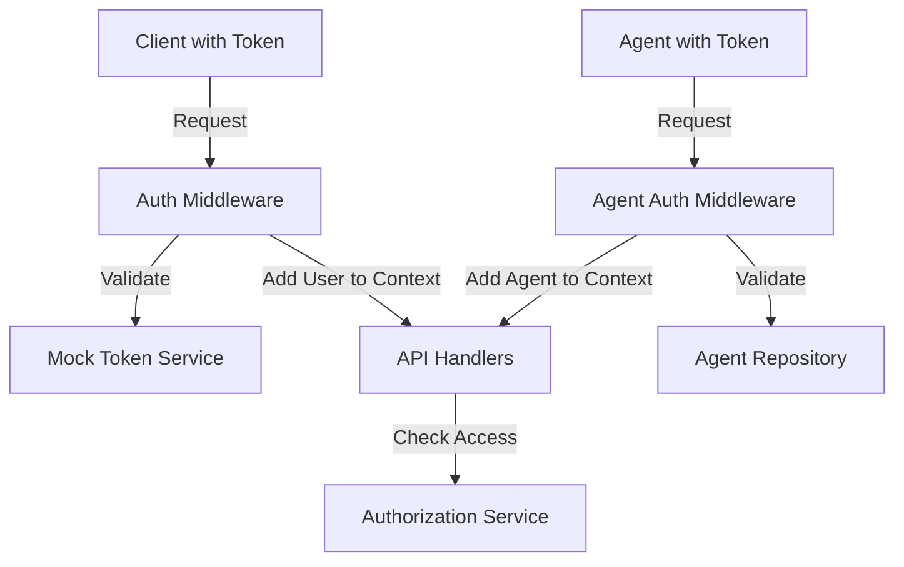

# Mock Authentication and Authorization Layer Design

## Introduction

This document outlines the design for a mock authentication and authorization layer for the Fulcrum Core API. The goal is to introduce a simple but effective security layer that can be later replaced with a proper OAuth server while maintaining the same interfaces and capabilities.

## Requirements

1. Support multiple user roles:
   - Fulcrum Administrators (full access to everything)
   - Provider Administrators (can manage only their own provider/tenant)
   - Marketplace (can operate on services and read metrics, but only for their own services)
   
2. Maintain the existing agent authentication mechanism that uses tokens

3. Implement a simple token-based system that can be replaced with OAuth later

4. Provide proper authorization checks based on user roles and resource ownership

## Architecture Overview



## Component Design

### 1. Domain Models for Authentication

These models will be added to `internal/domain/auth.go`:

```go
package domain

import (
	"time"
)

// UserRole represents different roles in the system
type UserRole string

const (
	RoleFulcrumAdmin  UserRole = "fulcrum_admin"
	RoleProviderAdmin UserRole = "provider_admin"
	RoleMarketplace   UserRole = "marketplace"
)

// AuthUser represents an authenticated user
type AuthUser struct {
	ID         UUID      `json:"id"`
	Username   string    `json:"username"`
	Role       UserRole  `json:"role"`
	ProviderID *UUID     `json:"providerId,omitempty"` // For provider admins
	CreatedAt  time.Time `json:"createdAt"`
}

// TokenService defines the interface for token validation
type TokenService interface {
	ValidateToken(token string) (*AuthUser, error)
}

// AuthorizationService defines authorization checks
type AuthorizationService interface {
	CanAccessProvider(user *AuthUser, providerID UUID) bool
	CanAccessService(user *AuthUser, serviceID UUID) bool
	CanAccessMetric(user *AuthUser, metricID UUID) bool
	// Other permission checks can be added as needed
}
```

### 2. Mock Token Service

This service will be implemented in `internal/auth/mock_token_service.go`:

```go
package auth

import (
	"errors"
	"fulcrumproject.org/core/internal/domain"
)

var (
	ErrInvalidToken = errors.New("invalid token")
)

// MockTokenService implements a simple token validation service with hardcoded tokens
type MockTokenService struct {
	tokens map[string]*domain.AuthUser
}

// NewMockTokenService creates a new instance of the mock token service
func NewMockTokenService() *MockTokenService {
	fulcrumAdminID, _ := domain.NewUUID()
	providerAdminID, _ := domain.NewUUID()
	marketplaceID, _ := domain.NewUUID()
	
	// Example provider ID for the provider admin
	providerID, _ := domain.NewUUID()

	return &MockTokenService{
		tokens: map[string]*domain.AuthUser{
			"fulcrum-admin-token": {
				ID:        fulcrumAdminID,
				Username:  "admin",
				Role:      domain.RoleFulcrumAdmin,
				CreatedAt: domain.Now(),
			},
			"provider-admin-token": {
				ID:         providerAdminID,
				Username:   "provider-admin",
				Role:       domain.RoleProviderAdmin,
				ProviderID: &providerID,
				CreatedAt:  domain.Now(),
			},
			"marketplace-token": {
				ID:        marketplaceID,
				Username:  "marketplace",
				Role:      domain.RoleMarketplace,
				CreatedAt: domain.Now(),
			},
		},
	}
}

// ValidateToken checks if the token is valid and returns the associated user
func (s *MockTokenService) ValidateToken(token string) (*domain.AuthUser, error) {
	user, ok := s.tokens[token]
	if !ok {
		return nil, ErrInvalidToken
	}
	return user, nil
}
```

### 3. Authorization Service

This service will be implemented in `internal/auth/authorization_service.go`:

```go
package auth

import (
	"fulcrumproject.org/core/internal/domain"
)

// MockAuthorizationService implements the AuthorizationService interface
type MockAuthorizationService struct {
	serviceRepo domain.ServiceQuerier
	providerRepo domain.ProviderQuerier
	metricRepo domain.MetricEntryQuerier
}

// NewMockAuthorizationService creates a new authorization service
func NewMockAuthorizationService(
	serviceRepo domain.ServiceQuerier, 
	providerRepo domain.ProviderQuerier,
	metricRepo domain.MetricEntryQuerier,
) *MockAuthorizationService {
	return &MockAuthorizationService{
		serviceRepo: serviceRepo,
		providerRepo: providerRepo,
		metricRepo: metricRepo,
	}
}

// CanAccessProvider checks if a user can access a provider
func (s *MockAuthorizationService) CanAccessProvider(user *domain.AuthUser, providerID domain.UUID) bool {
	if user == nil {
		return false
	}
	
	// Fulcrum admins can access any provider
	if user.Role == domain.RoleFulcrumAdmin {
		return true
	}
	
	// Provider admins can access only their own provider
	if user.Role == domain.RoleProviderAdmin && user.ProviderID != nil {
		return *user.ProviderID == providerID
	}
	
	// Other roles don't have access to providers
	return false
}

// CanAccessService checks if a user can access a service
func (s *MockAuthorizationService) CanAccessService(user *domain.AuthUser, serviceID domain.UUID) bool {
	if user == nil {
		return false
	}
	
	// Fulcrum admins can access any service
	if user.Role == domain.RoleFulcrumAdmin {
		return true
	}
	
	// For other roles, we need to check service ownership
	service, err := s.serviceRepo.FindByID(domain.NewContext(), serviceID)
	if err != nil {
		return false
	}
	
	// Provider admins can access services on their provider
	if user.Role == domain.RoleProviderAdmin && user.ProviderID != nil {
		// We'd need to check if the service's agent belongs to the provider
		if service.Agent != nil {
			return service.Agent.ProviderID == *user.ProviderID
		}
		return false
	}
	
	// Marketplace can access their own services
	// In a real implementation, you would check if the service belongs to this marketplace
	if user.Role == domain.RoleMarketplace {
		// For mock purposes, we'll allow access to all services for now
		// In a real implementation, services would have a marketplaceID field
		return true
	}
	
	return false
}

// CanAccessMetric checks if a user can access a metric
func (s *MockAuthorizationService) CanAccessMetric(user *domain.AuthUser, metricID domain.UUID) bool {
	if user == nil {
		return false
	}
	
	// Fulcrum admins can access any metric
	if user.Role == domain.RoleFulcrumAdmin {
		return true
	}
	
	// For other roles, we need to check metric ownership
	metric, err := s.metricRepo.FindByID(domain.NewContext(), metricID)
	if err != nil {
		return false
	}
	
	// Check service access since metrics are tied to services
	return s.CanAccessService(user, metric.ServiceID)
}
```

### 4. Authentication Middleware

This middleware will be implemented in `internal/api/auth_middleware.go`:

```go
package api

import (
	"context"
	"net/http"
	"strings"

	"fulcrumproject.org/core/internal/auth"
	"fulcrumproject.org/core/internal/domain"
	"github.com/go-chi/render"
)

// Context key for the authenticated user
const userContextKey = contextKey("user")

// AuthMiddleware creates middleware to authenticate users via token
func AuthMiddleware(tokenService domain.TokenService) func(http.Handler) http.Handler {
	return func(next http.Handler) http.Handler {
		return http.HandlerFunc(func(w http.ResponseWriter, r *http.Request) {
			// Extract token from Authorization header
			authHeader := r.Header.Get("Authorization")
			if authHeader == "" || !strings.HasPrefix(authHeader, "Bearer ") {
				// No auth header is required for public routes
				next.ServeHTTP(w, r)
				return
			}

			token := strings.TrimPrefix(authHeader, "Bearer ")
			
			// Validate token
			user, err := tokenService.ValidateToken(token)
			if err != nil {
				if err == auth.ErrInvalidToken {
					render.Render(w, r, ErrUnauthorized())
					return
				}
				render.Render(w, r, ErrInternal(err))
				return
			}
			
			// Add user to request context
			ctx := context.WithValue(r.Context(), userContextKey, user)
			next.ServeHTTP(w, r.WithContext(ctx))
		})
	}
}

// RequireAuthentication middleware ensures the user is authenticated
func RequireAuthentication(next http.Handler) http.Handler {
	return http.HandlerFunc(func(w http.ResponseWriter, r *http.Request) {
		if user := GetAuthenticatedUser(r); user == nil {
			render.Render(w, r, ErrUnauthorized())
			return
		}
		next.ServeHTTP(w, r)
	})
}

// RequireRole middleware ensures the user has a specific role
func RequireRole(role domain.UserRole) func(http.Handler) http.Handler {
	return func(next http.Handler) http.Handler {
		return http.HandlerFunc(func(w http.ResponseWriter, r *http.Request) {
			user := GetAuthenticatedUser(r)
			if user == nil || user.Role != role {
				render.Render(w, r, ErrForbidden())
				return
			}
			next.ServeHTTP(w, r)
		})
	}
}

// GetAuthenticatedUser retrieves the authenticated user from the context
func GetAuthenticatedUser(r *http.Request) *domain.AuthUser {
	user, _ := r.Context().Value(userContextKey).(*domain.AuthUser)
	return user
}
```

### 5. Error Response Update

We need to add a forbidden error to `internal/api/response_error.go`:

```go
// ErrForbidden returns a 403 Forbidden error response
func ErrForbidden() render.Renderer {
	return &ErrResponse{
		HTTPStatusCode: http.StatusForbidden,
		StatusText:     "Forbidden",
		ErrorText:      "You don't have permission to access this resource",
	}
}
```

### 6. API Handler Updates

Example for updating the service handler:

```go
func (h *ServiceHandler) handleGet(w http.ResponseWriter, r *http.Request) {
	id := GetUUIDParam(r)
	
	// Get the service
	service, err := h.querier.FindByID(r.Context(), id)
	if err != nil {
		render.Render(w, r, ErrNotFound())
		return
	}
	
	// Check authorization if user is authenticated
	if user := GetAuthenticatedUser(r); user != nil {
		if !h.authzService.CanAccessService(user, service.ID) {
			render.Render(w, r, ErrForbidden())
			return
		}
	}
	
	render.JSON(w, r, serviceToResponse(service))
}
```

### 7. Main.go Integration

Updates needed in `cmd/fulcrum/main.go`:

```go
// Initialize auth services
tokenService := auth.NewMockTokenService()
authzService := auth.NewMockAuthorizationService(serviceRepo, providerRepo, metricEntryRepo)

// Add authentication middleware to router
r.Use(
    middleware.Logger,
    middleware.Recoverer,
    render.SetContentType(render.ContentTypeJSON),
    api.AuthMiddleware(tokenService), // Add this line
)

// API routes with different authorization requirements
r.Route("/api/v1", func(r chi.Router) {
    // Public routes (if any)
    r.Route("/health", func(r chi.Router) {
        r.Get("/", func(w http.ResponseWriter, r *http.Request) {
            w.Write([]byte("OK"))
        })
    })
    
    // Protected routes by role
    
    // Routes for all authenticated users
    r.Group(func(r chi.Router) {
        r.Use(api.RequireAuthentication)
        
        // Fulcrum Admin routes
        r.Group(func(r chi.Router) {
            r.Use(api.RequireRole(domain.RoleFulcrumAdmin))
            // Add admin-specific routes here
            // Full control over all resources
        })
        
        // Provider Admin routes
        r.Group(func(r chi.Router) {
            r.Use(api.RequireRole(domain.RoleProviderAdmin))
            // Add provider admin-specific routes here
            // Authorization checks within handlers will limit to own provider
        })
        
        // Marketplace routes
        r.Group(func(r chi.Router) {
            r.Use(api.RequireRole(domain.RoleMarketplace))
            // Add marketplace-specific routes here
            // Authorization checks within handlers will limit to own services
        })
        
        // Shared authenticated routes
        r.Route("/providers", providerHandler.Routes())
        r.Route("/agent-types", agentTypeHandler.Routes())
        r.Route("/service-types", serviceTypeHandler.Routes())
        r.Route("/agents", agentHandler.Routes(agentAuthMiddleware))
        r.Route("/service-groups", serviceGroupHandler.Routes())
        r.Route("/services", serviceHandler.Routes())
        r.Route("/metric-types", metricTypeHandler.Routes())
        r.Route("/metric-entries", metricEntryHandler.Routes(agentAuthMiddleware))
        r.Route("/audit-entries", auditEntryHandler.Routes())
        r.Route("/jobs", jobHandler.Routes(agentAuthMiddleware))
    })
    
    // Agent-specific routes (using existing authentication)
    r.Route("/agents", func(r chi.Router) {
        r.Group(func(r chi.Router) {
            r.Use(agentAuthMiddleware)
            r.Put("/me/status", agentHandler.handleUpdateStatus)
            r.Get("/me", agentHandler.handleGetMe)
        })
    })
    
    r.Route("/jobs", func(r chi.Router) {
        r.Group(func(r chi.Router) {
            r.Use(agentAuthMiddleware)
            r.Get("/pending", jobHandler.handleListPending)
            r.Post("/{id}/claim", jobHandler.handleClaim)
            r.Post("/{id}/complete", jobHandler.handleComplete)
            r.Post("/{id}/fail", jobHandler.handleFail)
        })
    })
})
```

## Implementation Sequence

1. Create domain models for authentication and authorization in `internal/domain/auth.go`
2. Implement the mock token service in `internal/auth/mock_token_service.go`
3. Add the authorization service in `internal/auth/authorization_service.go`
4. Create the authentication middleware in `internal/api/auth_middleware.go`
5. Add the forbidden error to `internal/api/response_error.go`
6. Update API handlers to incorporate permission checks
7. Integrate with `main.go` to wire everything together

## Testing Strategy

1. **Unit Tests**:
   - Test token validation in the mock token service
   - Test authorization checks in the authorization service
   - Test middleware behavior with different tokens

2. **Integration Tests**:
   - Test authentication flow with valid and invalid tokens
   - Test authorization restrictions for different user roles
   - Ensure existing agent authentication still works

3. **Manual Testing**:
   - Test with hardcoded tokens for each role
   - Verify access controls are enforced correctly
   - Check that agent functionality is unaffected

## Migration Path to OAuth

When ready to implement a full OAuth server:

1. Create a new implementation of the `TokenService` interface that validates JWT tokens from your OAuth server
2. Configure your OAuth server to issue tokens with appropriate claims for roles and provider IDs
3. Update the authorization service to use the claims from the tokens
4. Replace the mock token service in your application with the new OAuth token service

## Benefits of This Approach

- **Simple Implementation**: Uses hardcoded tokens for quick development
- **Clear Interfaces**: Well-defined interfaces for authentication and authorization
- **Role-Based Security**: Enforces proper access controls based on user roles
- **Future-Proof**: Designed for easy replacement with a real OAuth server
- **Non-Disruptive**: Maintains compatibility with existing agent authentication

## Conclusion

This mock authentication and authorization layer provides a solid foundation for securing the Fulcrum Core API while preparing for a future OAuth integration. It separates concerns between authentication and authorization, maintains existing functionality, and introduces proper role-based access controls.

The implementation is deliberately simple, using hardcoded tokens as requested, while still providing a clear migration path to a more sophisticated OAuth solution in the future.