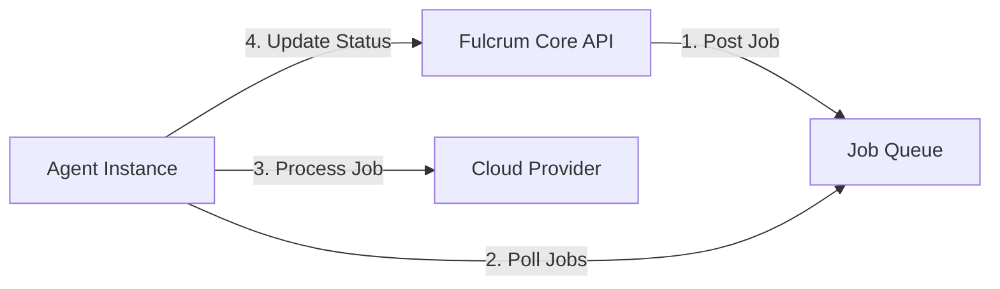
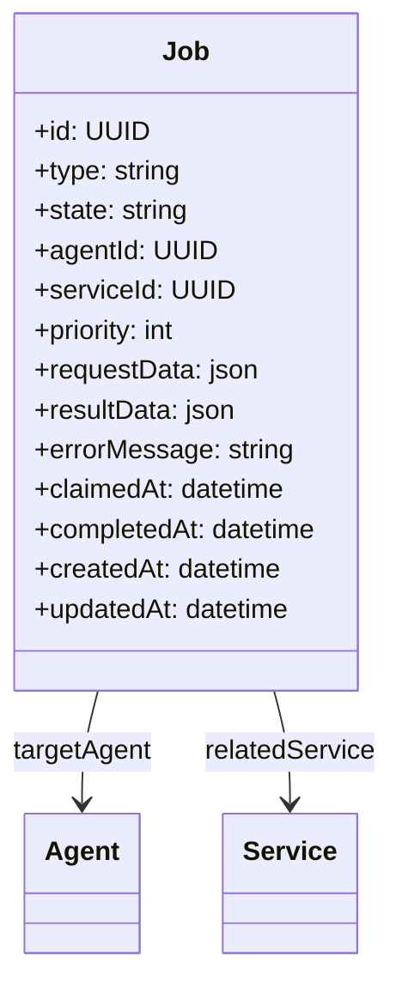
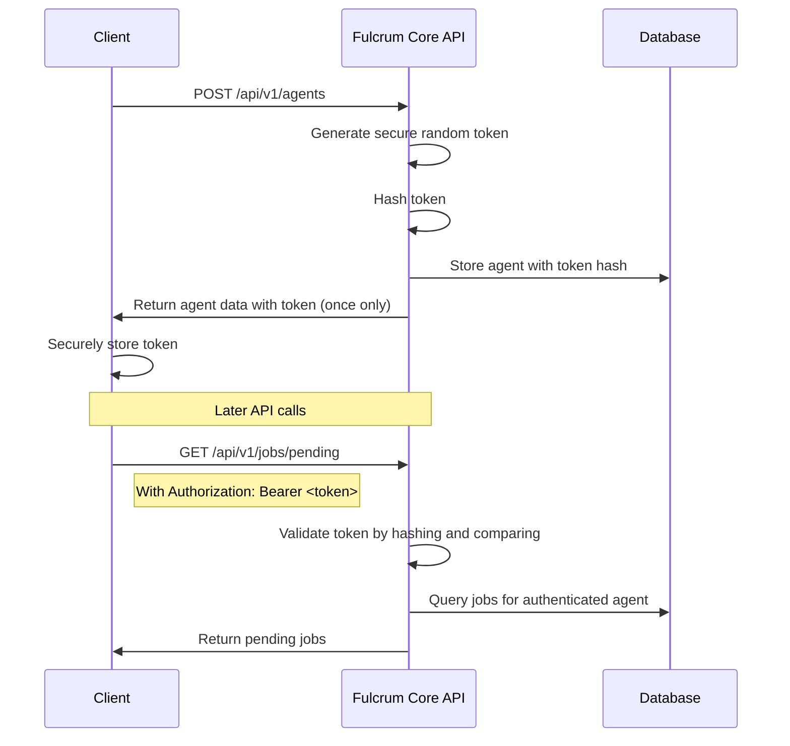

# Job Queue Implementation Plan for Fulcrum Core

## 1. Overview

The job queue will serve as a communication channel between the Fulcrum Core API and agent instances deployed across service providers. When services are created, updated, or deleted, jobs will be posted to this queue. Agents will poll the queue for relevant jobs and execute them.



## 2. Architecture

### 2.1 Domain Layer
- **Job Entity**: Represents a job to be executed by an agent
- **JobState Enum**: Tracks job lifecycle (Pending, Processing, Completed, Failed)
- **JobRepository Interface**: Defines methods for job queue operations

### 2.2 Service Layer
- **ServiceOperationService**: Handles service operations that require job creation
- **JobService**: Contains business logic for job management (when needed)

### 2.3 Database Layer
- **Job Database Model**: Database representation of the job entity
- **GormJobRepository**: Implementation of the JobRepository interface using GORM

### 2.4 API Layer
- **Job Handlers**: New API endpoints for job management
- **Service Handlers**: Modified to use ServiceOperationService for operations requiring job creation
- **Agent Job Endpoints**: For agents to claim and update jobs

## 3. Implementation Plan

### 3.1 Agent Token Generation

1. Update the Agent domain model to support secure token generation:
   ```go
   // GenerateToken creates a secure random token and sets the TokenHash field
   func (a *Agent) GenerateToken() (string, error) {
       // Generate a secure random token (32 bytes = 256 bits)
       tokenBytes := make([]byte, 32)
       if _, err := rand.Read(tokenBytes); err != nil {
           return "", err
       }
       
       // Convert to base64 for readability
       token := base64.URLEncoding.EncodeToString(tokenBytes)
       
       // Store only the hash of the token
       a.TokenHash = HashToken(token)
       
       return token, nil
   }
   
   // HashToken creates a secure hash of a token
   func HashToken(token string) string {
       hash := sha256.Sum256([]byte(token))
       return base64.StdEncoding.EncodeToString(hash[:])
   }
   ```

2. Modify the Agent create handler to generate and return the token only during creation:
   ```go
   // api/agent_handlers.go
   
   // AgentCreateResponse extends AgentResponse with a token field
   type AgentCreateResponse struct {
       *AgentResponse
       Token string `json:"token,omitempty"` // Only included in creation response
   }
   
   func (h *AgentHandler) handleCreate(w http.ResponseWriter, r *http.Request) {
       var req CreateUpdateAgentRequest
       if err := render.Decode(r, &req); err != nil {
           render.Render(w, r, ErrInvalidRequest(err))
           return
       }
       
       providerID, err := domain.ParseUUID(req.ProviderID)
       if err != nil {
           render.Render(w, r, ErrInvalidRequest(err))
           return
       }
       
       agentTypeID, err := domain.ParseUUID(req.AgentTypeID)
       if err != nil {
           render.Render(w, r, ErrInvalidRequest(err))
           return
       }
       
       agent := &domain.Agent{
           Name:        req.Name,
           State:       req.State,
           CountryCode: req.CountryCode,
           Attributes:  domain.Attributes(req.Attributes),
           Properties:  req.Properties,
           ProviderID:  providerID,
           AgentTypeID: agentTypeID,
       }
       
       // Generate a secure token for the agent
       token, err := agent.GenerateToken()
       if err != nil {
           render.Render(w, r, ErrInternal(err))
           return
       }
       
       if !agent.State.IsValid() {
           render.Render(w, r, ErrInvalidRequest(domain.ErrInvalidAgentState))
           return
       }
       
       if err := h.repo.Create(r.Context(), agent); err != nil {
           render.Render(w, r, ErrInternal(err))
           return
       }
       
       // Return the agent with the token (one time only)
       resp := &AgentCreateResponse{
           AgentResponse: agentToResponse(agent),
           Token:         token,
       }
       
       render.Status(r, http.StatusCreated)
       render.JSON(w, r, resp)
   }
   ```

3. Update the CreateUpdateAgentRequest to no longer accept TokenHash:
   ```go
   // CreateUpdateAgentRequest represents the request body for creating/updating an agent
   type CreateUpdateAgentRequest struct {
       Name        string                 `json:"name"`
       State       domain.AgentState      `json:"state"`
       CountryCode string                 `json:"countryCode,omitempty"`
       Attributes  map[string][]string    `json:"attributes,omitempty"`
       Properties  map[string]interface{} `json:"properties,omitempty"`
       ProviderID  string                 `json:"providerId"`
       AgentTypeID string                 `json:"agentTypeId"`
       // TokenHash removed since it's now managed internally
   }
   ```

4. Modify the agent update handler to not allow token hash updates:
   ```go
   func (h *AgentHandler) handleUpdate(w http.ResponseWriter, r *http.Request) {
       // ... existing code ...
       
       // Update fields but preserve the token hash
       currentTokenHash := agent.TokenHash
       agent.Name = req.Name
       agent.State = req.State
       agent.CountryCode = req.CountryCode
       agent.Attributes = domain.Attributes(req.Attributes)
       agent.Properties = req.Properties
       agent.ProviderID = providerID
       agent.AgentTypeID = agentTypeID
       agent.TokenHash = currentTokenHash // Preserve the token hash
       
       // ... rest of the function remains the same ...
   }
   ```

5. Implement a token rotation endpoint if needed (for security purposes):
   ```go
   func (h *AgentHandler) handleRotateToken(w http.ResponseWriter, r *http.Request) {
       id, err := domain.ParseUUID(chi.URLParam(r, "id"))
       if err != nil {
           render.Render(w, r, ErrInvalidRequest(err))
           return
       }
       
       agent, err := h.repo.FindByID(r.Context(), id)
       if err != nil {
           render.Render(w, r, ErrNotFound())
           return
       }
       
       // Generate a new token
       token, err := agent.GenerateToken()
       if err != nil {
           render.Render(w, r, ErrInternal(err))
           return
       }
       
       // Save the agent with the new token hash
       if err := h.repo.Save(r.Context(), agent); err != nil {
           render.Render(w, r, ErrInternal(err))
           return
       }
       
       // Return the new token
       resp := &AgentCreateResponse{
           AgentResponse: agentToResponse(agent),
           Token:         token,
       }
       
       render.JSON(w, r, resp)
   }
   ```

6. Register the token rotation endpoint in the router:
   ```go
   func (h *AgentHandler) Routes() chi.Router {
       r := chi.NewRouter()
       
       // Middleware for all agent routes
       r.Use(render.SetContentType(render.ContentTypeJSON))
       
       r.Get("/", h.handleList)
       r.Post("/", h.handleCreate)
       r.Get("/{id}", h.handleGet)
       r.Put("/{id}", h.handleUpdate)
       r.Delete("/{id}", h.handleDelete)
       r.Post("/{id}/rotate-token", h.handleRotateToken) // New endpoint
       
       return r
   }
   ```

### 3.2 Define Domain Entities and Interfaces

1. Create a new domain entity for jobs with the following structure:
   ```go
   type Job struct {
       BaseEntity
       Type         JobType       // e.g., ServiceCreate, ServiceUpdate, ServiceDelete
       State        JobState      // Pending, Processing, Completed, Failed
       AgentID      UUID          // Target agent (if specific)
       ServiceID    UUID          // Related service
       Priority     int           // Job priority
       RequestData  JSON          // Job-specific data
       ResultData   JSON          // Result information after processing
       ErrorMessage string        // Error details if failed
       ClaimedAt    *time.Time    // When an agent claimed this job
       CompletedAt  *time.Time    // When the job was completed
   }
   ```

2. Define job states and types:
   ```go
   type JobState string
   
   const (
       JobPending    JobState = "Pending"
       JobProcessing JobState = "Processing"
       JobCompleted  JobState = "Completed"
       JobFailed     JobState = "Failed"
   )

   type JobType string
   
   const (
       JobServiceCreate JobType = "ServiceCreate"
       JobServiceUpdate JobType = "ServiceUpdate"
       JobServiceDelete JobType = "ServiceDelete"
   )
   ```

3. Define the JobRepository interface:
   ```go
   type JobRepository interface {
       Create(ctx context.Context, job *Job) error
       Save(ctx context.Context, job *Job) error
       FindByID(ctx context.Context, id UUID) (*Job, error)
       List(ctx context.Context, pagination *Pagination) (*PaginatedResult[Job], error)
       
       // Queue specific operations
       GetPendingJobsForAgent(ctx context.Context, agentID UUID, limit int) ([]*Job, error)
       ClaimJob(ctx context.Context, jobID UUID, agentID UUID) error
       CompleteJob(ctx context.Context, jobID UUID, resultData JSON) error
       FailJob(ctx context.Context, jobID UUID, errorMessage string) error
       
       // Maintenance operations
       ReleaseStuckJobs(ctx context.Context, olderThan int) (int, error)
       DeleteOldCompletedJobs(ctx context.Context, olderThan int) (int, error)
   }
   ```

4. Enhance the AgentRepository interface for token-based authentication:
   ```go
   // Add to existing AgentRepository interface
   // FindByToken finds an agent by token hash
   FindByToken(ctx context.Context, tokenHash string) (*Agent, error)
   ```

### 3.3 Implement Service Layer (for business logic)

1. Create ServiceOperationService for operations that require job creation:
   ```go
   // internal/service/service_operation_service.go
   type ServiceOperationService struct {
       serviceRepo domain.ServiceRepository
       jobRepo     domain.JobRepository
   }
   
   func NewServiceOperationService(
       serviceRepo domain.ServiceRepository, 
       jobRepo domain.JobRepository,
   ) *ServiceOperationService {
       return &ServiceOperationService{
           serviceRepo: serviceRepo,
           jobRepo:     jobRepo,
       }
   }
   
   // CreateService handles service creation and creates a job for the agent
   func (s *ServiceOperationService) CreateService(ctx context.Context, service *domain.Service) error {
       // Create the service
       if err := s.serviceRepo.Create(ctx, service); err != nil {
           return err
       }
       
       // Create a job for the agent
       job := &domain.Job{
           Type:      domain.JobServiceCreate,
           State:     domain.JobPending,
           AgentID:   service.AgentID,
           ServiceID: service.ID,
           Priority:  1,
           RequestData: map[string]interface{}{
               "serviceId": service.ID.String(),
               "resources": service.Resources,
           },
       }
       
       return s.jobRepo.Create(ctx, job)
   }
   
   // UpdateService handles service updates and creates a job for the agent
   func (s *ServiceOperationService) UpdateService(ctx context.Context, service *domain.Service) error {
       // Update the service
       if err := s.serviceRepo.Save(ctx, service); err != nil {
           return err
       }
       
       // Create a job for the agent
       job := &domain.Job{
           Type:      domain.JobServiceUpdate,
           State:     domain.JobPending,
           AgentID:   service.AgentID,
           ServiceID: service.ID,
           Priority:  1,
           RequestData: map[string]interface{}{
               "serviceId": service.ID.String(),
               "resources": service.Resources,
           },
       }
       
       return s.jobRepo.Create(ctx, job)
   }
   
   // DeleteService handles service deletion and creates a job for the agent
   func (s *ServiceOperationService) DeleteService(ctx context.Context, serviceID domain.UUID) error {
       // First get the service to know which agent should handle the deletion
       service, err := s.serviceRepo.FindByID(ctx, serviceID)
       if err != nil {
           return err
       }
       
       // Create a job for the agent before deleting the service
       job := &domain.Job{
           Type:      domain.JobServiceDelete,
           State:     domain.JobPending,
           AgentID:   service.AgentID,
           ServiceID: service.ID,
           Priority:  1,
           RequestData: map[string]interface{}{
               "serviceId": service.ID.String(),
           },
       }
       
       if err := s.jobRepo.Create(ctx, job); err != nil {
           return err
       }
       
       // Delete the service
       return s.serviceRepo.Delete(ctx, serviceID)
   }
   ```

2. Use a minimal JobService only for operations with specific business logic:
   ```go
   // internal/service/job_service.go
   type JobService struct {
       jobRepo domain.JobRepository
   }
   
   func NewJobService(jobRepo domain.JobRepository) *JobService {
       return &JobService{jobRepo: jobRepo}
   }
   
   // ReleaseStuckJobs releases jobs that have been processing for too long
   func (s *JobService) ReleaseStuckJobs(ctx context.Context, olderThanMinutes int) (int, error) {
       return s.jobRepo.ReleaseStuckJobs(ctx, olderThanMinutes)
   }
   
   // CleanupOldJobs removes completed/failed jobs older than specified days
   func (s *JobService) CleanupOldJobs(ctx context.Context, olderThanDays int) (int, error) {
       return s.jobRepo.DeleteOldCompletedJobs(ctx, olderThanDays)
   }
   ```

### 3.4 Implement Database Layer

1. Create a database model for jobs:
   ```go
   // database/gorm_job_repository.go
   func NewJobRepository(db *gorm.DB) domain.JobRepository {
       return &gormJobRepository{db: db}
   }
   
   type gormJobRepository struct {
       db *gorm.DB
   }
   
   // Implement all JobRepository methods...
   ```

2. Implement FindByToken method in agent repository:
   ```go
   // FindByToken finds an agent by token hash
   func (r *gormAgentRepository) FindByToken(ctx context.Context, tokenHash string) (*domain.Agent, error) {
       var agent domain.Agent
       
       err := r.db.WithContext(ctx).
           Preload("Provider").
           Preload("AgentType").
           Where("token_hash = ?", tokenHash).
           First(&agent).Error
           
       if err != nil {
           if errors.Is(err, gorm.ErrRecordNotFound) {
               return nil, domain.ErrNotFound
           }
           return nil, err
       }
       
       return &agent, nil
   }
   ```

3. Add database migration for the jobs table

### 3.5 Update API Layer

1. Modify service handlers to use the service layer:
   ```go
   // service_handlers.go
   type ServiceHandler struct {
       serviceOps *service.ServiceOperationService
   }
   
   func NewServiceHandler(serviceOps *service.ServiceOperationService) *ServiceHandler {
       return &ServiceHandler{serviceOps: serviceOps}
   }
   
   func (h *ServiceHandler) handleCreate(w http.ResponseWriter, r *http.Request) {
       var req CreateUpdateServiceRequest
       if err := render.Decode(r, &req); err != nil {
           render.Render(w, r, ErrInvalidRequest(err))
           return
       }
       
       // Convert request to domain object
       service := requestToService(req)
       
       // Use service layer to create service and associated job
       if err := h.serviceOps.CreateService(r.Context(), service); err != nil {
           render.Render(w, r, ErrInternal(err))
           return
       }
       
       render.Status(r, http.StatusCreated)
       render.JSON(w, r, serviceToResponse(service))
   }
   
   // Similar updates for handleUpdate and handleDelete methods
   ```

2. Implement job handlers with token-based authentication:
   ```go
   // api/job_handlers.go
   type JobHandler struct {
       repo      domain.JobRepository
       agentRepo domain.AgentRepository
   }
   
   func NewJobHandler(repo domain.JobRepository, agentRepo domain.AgentRepository) *JobHandler {
       return &JobHandler{
           repo:      repo,
           agentRepo: agentRepo,
       }
   }
   
   func (h *JobHandler) Routes() chi.Router {
       r := chi.NewRouter()
       
       // Apply content type middleware
       r.Use(render.SetContentType(render.ContentTypeJSON))
       
       // Agent authenticated routes
       r.Group(func(r chi.Router) {
           r.Use(AgentAuthMiddleware(h.agentRepo))
           
           r.Get("/pending", h.handleGetPendingJobs)      // For agents to poll for jobs
           r.Post("/{id}/claim", h.handleClaimJob)        // For agents to claim a job
           r.Post("/{id}/complete", h.handleCompleteJob)  // For agents to mark a job as completed
           r.Post("/{id}/fail", h.handleFailJob)          // For agents to mark a job as failed
       })
       
       // Admin routes
       r.Get("/", h.handleList)
       r.Get("/{id}", h.handleGet)
       
       return r
   }
   
   // AgentAuthMiddleware authenticates requests using agent tokens
   func AgentAuthMiddleware(repo domain.AgentRepository) func(http.Handler) http.Handler {
       return func(next http.Handler) http.Handler {
           return http.HandlerFunc(func(w http.ResponseWriter, r *http.Request) {
               // Extract token from Authorization header
               authHeader := r.Header.Get("Authorization")
               if authHeader == "" || !strings.HasPrefix(authHeader, "Bearer ") {
                   render.Render(w, r, ErrUnauthorized("Missing or invalid authorization header"))
                   return
               }
               
               token := strings.TrimPrefix(authHeader, "Bearer ")
               tokenHash := hashToken(token) // Would use the same hashing function as when storing tokens
               
               // Find agent by token hash
               agent, err := repo.FindByToken(r.Context(), tokenHash)
               if err != nil {
                   render.Render(w, r, ErrUnauthorized("Invalid token"))
                   return
               }
               
               // Store authenticated agent in request context
               ctx := context.WithValue(r.Context(), "authenticatedAgent", agent)
               next.ServeHTTP(w, r.WithContext(ctx))
           })
       }
   }
   
   // GetAuthenticatedAgent retrieves the authenticated agent from the request context
   func GetAuthenticatedAgent(r *http.Request) *domain.Agent {
       agent, _ := r.Context().Value("authenticatedAgent").(*domain.Agent)
       return agent
   }
   
   // Implementation of job handlers
   func (h *JobHandler) handleGetPendingJobs(w http.ResponseWriter, r *http.Request) {
       // Get authenticated agent from context (set by middleware)
       agent := GetAuthenticatedAgent(r)
       if agent == nil {
           render.Render(w, r, ErrUnauthorized("Authentication required"))
           return
       }
       
       // Parse limit parameter
       limitStr := r.URL.Query().Get("limit")
       limit := 10 // Default
       if limitStr != "" {
           parsedLimit, err := strconv.Atoi(limitStr)
           if err == nil && parsedLimit > 0 {
               limit = parsedLimit
           }
       }
       
       // Get pending jobs for this agent
       jobs, err := h.repo.GetPendingJobsForAgent(r.Context(), agent.ID, limit)
       if err != nil {
           render.Render(w, r, ErrInternal(err))
           return
       }
       
       // Return jobs
       render.JSON(w, r, jobs)
   }
   
   func (h *JobHandler) handleClaimJob(w http.ResponseWriter, r *http.Request) {
       // Get authenticated agent from context (set by middleware)
       agent := GetAuthenticatedAgent(r)
       if agent == nil {
           render.Render(w, r, ErrUnauthorized("Authentication required"))
           return
       }
       
       // Parse job ID from URL
       jobID, err := domain.ParseUUID(chi.URLParam(r, "id"))
       if err != nil {
           render.Render(w, r, ErrInvalidRequest(err))
           return
       }
       
       // Claim job for this agent
       if err := h.repo.ClaimJob(r.Context(), jobID, agent.ID); err != nil {
           render.Render(w, r, ErrDomain(err))
           return
       }
       
       w.WriteHeader(http.StatusNoContent)
   }
   
   // Similar implementations for handleCompleteJob and handleFailJob
   ```

### 3.6 Update Agent Communication Protocol

1. Agents will poll for pending jobs using token authentication:
   ```
   GET /api/v1/jobs/pending?limit=10
   Authorization: Bearer <agent_token>
   ```

2. Agents will claim jobs for processing using token authentication:
   ```
   POST /api/v1/jobs/{id}/claim
   Authorization: Bearer <agent_token>
   ```

3. Agents will update job status after processing:
   - Success: 
     ```
     POST /api/v1/jobs/{id}/complete
     Authorization: Bearer <agent_token>
     Body: { "resultData": { ... } }
     ```
   - Failure: 
     ```
     POST /api/v1/jobs/{id}/fail
     Authorization: Bearer <agent_token>
     Body: { "errorMessage": "Error details" }
     ```

4. Example agent workflow:
   ```
   1. Agent polls /api/v1/jobs/pending periodically with its token in the Authorization header
   2. When jobs are available, agent claims a job using its token for authentication
   3. Agent processes the job (e.g., creates/updates/deletes a service)
   4. Agent updates job status:
      - Success: POST /api/v1/jobs/{id}/complete (with resultData)
      - Failure: POST /api/v1/jobs/{id}/fail (with error message)
   ```

### 3.7 Add Job Monitoring and Management

1. Implement job cleanup for old jobs
2. Add job retry mechanism for failed jobs
3. Implement job prioritization

### 3.8 Update Main Application

```go
// cmd/fulcrum/main.go
func main() {
    // Initialize database
    dbConfig := database.NewConfigFromEnv()
    db, err := database.NewConnection(dbConfig)
    if err != nil {
        log.Fatalf("Failed to connect to database: %v", err)
    }
    
    // Initialize repositories
    jobRepo := database.NewJobRepository(db)
    serviceRepo := database.NewServiceRepository(db)
    agentRepo := database.NewAgentRepository(db)
    // Other repositories...
    
    // Initialize services (only where business logic exists)
    serviceOps := service.NewServiceOperationService(serviceRepo, jobRepo)
    jobService := service.NewJobService(jobRepo)
    
    // Initialize handlers
    serviceHandler := api.NewServiceHandler(serviceOps)
    jobHandler := api.NewJobHandler(jobRepo, agentRepo)
    
    // Initialize router
    r := chi.NewRouter()
    
    // API routes
    r.Route("/api/v1", func(r chi.Router) {
        // Existing routes
        r.Mount("/services", serviceHandler.Routes())
        // Add jobs route
        r.Mount("/jobs", jobHandler.Routes())
    })
    
    // Setup background job maintenance worker
    go func() {
        ticker := time.NewTicker(10 * time.Minute)
        for range ticker.C {
            ctx := context.Background()
            jobService.ReleaseStuckJobs(ctx, 30)    // 30 minutes timeout
            jobService.CleanupOldJobs(ctx, 7)       // 7 days retention
        }
    }()
    
    // Start server
    log.Println("Server starting on port 3000...")
    if err := http.ListenAndServe(":3000", r); err != nil {
        log.Fatalf("Failed to start server: %v", err)
    }
}
```

## 4. Database Schema



## 5. API Endpoints

### Job Management API

| Endpoint                     | Method | Description                                  |
| ---------------------------- | ------ | -------------------------------------------- |
| `/api/v1/jobs`               | GET    | List all jobs (admin)                        |
| `/api/v1/jobs/{id}`          | GET    | Get job details (admin)                      |
| `/api/v1/jobs/pending`       | GET    | Get pending jobs for the authenticated agent |
| `/api/v1/jobs/{id}/claim`    | POST   | Claim a job for processing                   |
| `/api/v1/jobs/{id}/complete` | POST   | Mark a job as completed                      |
| `/api/v1/jobs/{id}/fail`     | POST   | Mark a job as failed                         |

### Authentication Headers for All Agent Endpoints

All agent endpoints require the following authentication header:

```
Authorization: Bearer <agent_token>
```

The token is provided once during agent creation and should be securely stored by the agent client.

## 6. Implementation Timeline

1. **Week 1**: Design and implement domain entities and interfaces
2. **Week 2**: Implement database layer and migrations
3. **Week 3**: Implement service layer and update API handlers
4. **Week 4**: Implement agent communication protocol
5. **Week 5**: Testing, monitoring, and optimization

## 7. Scaling Considerations

1. **High Availability**: The job queue should be resilient to failures
   - Implement database-level locking to prevent job claim conflicts
   - Consider distributed locking mechanisms for multi-instance deployments

2. **Performance**: Jobs should be processed efficiently by agents
   - Index the jobs table for efficient queries
   - Implement batch processing for high-volume scenarios
   - Consider sharding for very high-scale deployments

3. **Monitoring**: Implement metrics for queue length, processing time, etc.
   - Track queue depth over time
   - Monitor job processing times
   - Alert on stalled jobs (claimed but not completed/failed)

4. **Retry Mechanism**: Implement retries for failed jobs
   - Auto-reset jobs to Pending state after timeout
   - Implement exponential backoff for retries
   - Set maximum retry attempts

5. **Dead Letter Queue**: Store permanently failed jobs for analysis
   - Move repeatedly failed jobs to a separate table or flag them
   - Provide admin interface for reviewing failed jobs

## 8. Future Enhancements

1. **Job Batching**: Allow agents to claim multiple jobs at once
2. **Job Prioritization**: Prioritize critical jobs
3. **Job Dependencies**: Allow jobs to depend on other jobs
4. **External Queue Integration**: Allow integration with external message brokers like RabbitMQ, Kafka, or cloud provider queues

## 9. Comparison with Cloud Provider Queues

### AWS SQS-like Features to Implement

- Visibility timeout (job claim expires if not completed)
- Dead-letter queue functionality
- Long polling for efficient job retrieval
- Message attributes (job metadata)

### Azure Queue Storage-like Features to Implement

- Queue metrics and monitoring
- Poison message handling (failed job isolation)
- Lease mechanism (similar to claim functionality)
- Message TTL (time-to-live)

## 10. Agent Authentication and Security

### 10.1 Token-Based Authentication

The job queue uses token-based authentication for all agent operations:

1. **Token Generation**: When an agent is created, a secure random token is generated and returned to the client only once
2. **Token Storage**: Only the hash of the token is stored in the database, never the token itself
3. **Token Usage**: Agents include their token in an Authorization header for all requests
4. **Security Benefits**:
   - More secure than agent ID-based authentication
   - Follows API security best practices
   - Tokens can be rotated if compromised without changing agent identity
   - Original tokens are never stored in the database or logs

### 10.2 Token Generation and Usage Flow

1. Client calls `POST /api/v1/agents` to create a new agent
2. Server generates a secure random token for the agent
3. Server stores only the hash of the token in the database
4. Server returns the token to the client as part of the creation response
5. Client must securely store this token as it will never be returned again
6. For all subsequent API calls, the client includes the token in the Authorization header



### 10.3 Token Rotation

To support security best practices, a token rotation endpoint is provided:

1. Administrative users can rotate an agent's token if needed
2. `POST /api/v1/agents/{id}/rotate-token` will generate a new token
3. The new token is returned to the caller and must be distributed to the agent
4. The old token is immediately invalidated

### 10.4 Authentication Flow


1. Agent is created with a secure token
2. Agent stores this token securely
3. For each request to the job queue API, agent includes token in Authorization header
4. API validates token by comparing its hash with the stored hash
5. If valid, request proceeds with the authenticated agent's context

### 10.5 Agent Repository Enhancement

The `AgentRepository` interface requires an additional method to support token authentication:

```go
// FindByTokenHash finds an agent by the hash of their token
FindByTokenHash(ctx context.Context, tokenHash string) (*Agent, error)
```

This method will be implemented in the GORM repository to look up agents by their token hash:

```go
func (r *gormAgentRepository) FindByTokenHash(ctx context.Context, tokenHash string) (*domain.Agent, error) {
    var agent domain.Agent
    
    err := r.db.WithContext(ctx).
        Preload("Provider").
        Preload("AgentType").
        Where("token_hash = ?", tokenHash).
        First(&agent).Error
        
    if err != nil {
        if errors.Is(err, gorm.ErrRecordNotFound) {
            return nil, domain.ErrNotFound
        }
        return nil, err
    }
    
    return &agent, nil
}
```